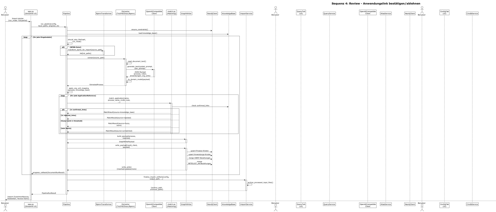

# Bridgr
**Neo4j als Single Source of Truth — Pending-Kandidaten im Graphen** | Stand: Juni 2026 | v0.23

---

## 1. Ziel

Prozessdokumentation und CMDB-Export zusammenfuehren, um einen EA-Wissensgraphen aufzubauen
und ihn ueber eine natuerlichsprachliche Web-Oberflaeche abfragbar zu machen.

Kernfrage:
Welche IT-Bausteine unterstuetzen welche Geschaeftsprozesse und wie sicher wissen wir das?

Bridgr schliesst die Luecke klassischer Discovery-Tools: Diese kennen die IT-Landschaft,
aber nicht den Business-Kontext aus Prozessdokumentation.

### Visionsziel: vollwertiger EA-Chatbot

Der Tab "Kommunikation" ist kein einfaches Query-Werkzeug, sondern ein vollwertiger
Unternehmens-Architektur-Chatbot. Benutzer stellen Fragen in natuerlicher Sprache zu
IT-Bausteinen, Prozessen und deren Beziehungen und erhalten kontextbewusste,
gesprächsfoerdernde Antworten — unabhaengig davon, wie die Frage formuliert ist.

Dieses Visionsziel ist der Massstab fuer alle Designentscheidungen im Abfrage-Layer.
Jede Abwaegung in diesem Bereich wird daran gemessen.

---

## 2. Gesamtarchitektur

Das System besteht aus zwei klar getrennten Schichten:

- Pipeline:
  Prozessdokumente + CMDB + ArchiMate-Modelle -> optionale Vortransformation fuer grosse BPMN
  -> Extraktion -> Matching -> Review-Artefakte -> Graph-DB
- Abfrage-Layer:
  Web-UI -> LLM (Orchestrator) -> Tool: Cypher-Ausfuehrung -> Neo4j -> Antwort in
  natuerlicher Sprache

Die Pipeline bleibt sequentiell, nachvollziehbar und idempotent.

Der LLM ist Orchestrator im Abfrage-Layer; imperativische Code-seitige
Gesprächszustandsverwaltung entfaellt zugunsten von nativem LLM-Konversationsmanagement.

**Neo4j ist die einzige kanonische Quelle fuer alle Entscheidungen** (bestaetigt, abgelehnt,
offen). Die Datei `kb.json` ist zur Loesung vorgemerkt (siehe Finding #15). Sie darf
vorlaeufig noch existieren, soll aber weder aktiv befuellt noch gelesen werden.

---

## 3. Inputs und Dateifluss

### 3.1 Eingangsdateien

- Prozessdokumente:
  BPMN sowie unstrukturierte Prozessbeschreibungen als TXT, DOCX oder PDF
- Transformierte BPMN-Prozessdateien:
  aus grossen BPMN/XML-Dateien abgeleitete, kompakte TXT-Dateien mit genau einer
  Importeinheit pro Prozess
- CMDB-Export:
  vorerst nur CSV
- ArchiMate-Modelle:
  ArchiMate Exchange Format 3.x als XML (Dateiendung `.xml` oder `.archimate`)

ArchiMate-Dateien ersetzen die bestehenden Eingabeformate nicht. Sie ergaenzen den
BRIDGR-Graphen um eine weitere Quelle — analog zum CMDB-Import.

### 3.2 Inbox-Prinzip

`Input/` ist die reine Inbox des Benutzers.

- der Benutzer legt dort neue Prozessdateien, die aktuell zu verwendende CMDB-Datei
  und ArchiMate-Modelle ab
- `Input/` und seine Unterordner dienen nicht als dauerhafter Ablageort bereits
  verarbeiteter Prozessdateien
- nach einem erfolgreichen Importlauf verschwinden die verarbeiteten Prozessdateien
  aus der Inbox

### 3.3 Archivierung verarbeiteter Dateien

```text
bridgr/
├── Input/
├── data/
│   └── input_archive/
│       └── <run-id-oder-timestamp>/
│           ├── <prozessdatei1>
│           └── ...
```

---

## 4. Scope v0.23

| Bereich | In Scope | Out of Scope |
|---|---|---|
| Eingabeformate | BPMN, TXT, DOCX, PDF, CMDB als CSV, ArchiMate Exchange Format 3.x | ODT/ODF, weitere CMDB-Formate, Archi-natives `.archimate`-Format |
| UI | Streamlit Web-UI (5 Tabs) | CLI-Review |
| Chat-Architektur | Tool-Use (LLM als Orchestrator) mit Prompt-Only-Fallback | Multi-Agenten-Orchestrierung |
| LLM-Backends | OpenAI-kompatible API (lokal und remote); Tool-Use wenn unterstuetzt | cloud-spezifische Provider-Integrationen |
| Review | Bearbeitung schwacher oder offener Matching-Faelle inkl. ArchiMate-Kandidaten | Externes Ticketing |
| Lauf-Modi | `full`, `partial` | automatische Delta-Erkennung als eigener UI-Modus |
| CMDB-Modell | `Anwendung`, `Schnittstelle`, `Server`, `OrgEinheit` | tiefe Attributmodellierung |
| ArchiMate-Export | Vollstaendiger Graph als ArchiMate Exchange Format (ohne Views) | Views/Viewpoints, selektiver Export, Archi-natives Format |
| ArchiMate-Import-Mapping | Erweiterbar: beliebige AM-Typen koennen auf BRIDGR-Labels gemappt werden (m:1) | Neue BRIDGR-Labels aus ArchiMate-Typen |
| Export-Precheck | Nodes ohne archimate_type vor Export anzeigen und tippen | Automatische Typ-Ableitung ohne Benutzerbestaetigung |
| Deployment | Lokal / Docker | Cloud-Deployment |
| Rollen-Modell | Lanes als `:Rolle` mit `BETEILIGT_AN`; `KANN_EINNEHMEN` als kuratierbarer Link | automatische OrgEinheit-Ableitung aus Lanes |
| Pending-Kandidaten | Schwache Matches als `KÖNNTE_DIENEN` und `KÖNNTE_VERANTWORTEN` im Graphen | automatische Bestaetigung ohne Benutzeraktion |
| Entscheidungspersistenz | Ablehnungen als `(:Ablehnung)`-Knoten in Neo4j | kb.json als Entscheidungsquelle |

---

## 5. Domaenenmodell

### Prozess

Ein Prozess entspricht bei BPMN einem `<process>`-Element. Bei transformierten
BPMN-TXT-Dateien entspricht eine Datei genau einem Prozess.

### folgt_auf

Bei BPMN aus dem Sequenzzusammenhang abgeleitet. Bei unstrukturierten Formaten nur dann
befuellt, wenn die Beschreibung dies explizit hergibt.

### Anwendung

Ein in der CMDB gefuehrtes System. Pflichtattribute: `id`, `name`.

### Schnittstelle

Ein in der CMDB separat gefuehrter Integrations- oder Uebergabepunkt. Pflichtattribute:
`id`, `name`.

### Server

Ein physischer oder virtueller Infrastrukturknoten aus der CMDB. Pflichtattribute: `id`,
`name`, `server_type` (`physical` oder `virtual`).

### Rolle

Eine `Rolle` repraesentiert einen Prozessteilnehmer auf Prozessebene — typischerweise aus
einer BPMN-Lane abgeleitet. Sie ist bewusst von `OrgEinheit` getrennt: Beteiligung an
einem Prozess impliziert keine Eigentuemer- oder Verantwortungsbeziehung.

Rollen werden immer aus Prozessquellen extrahiert; sie entstehen nie aus CMDB-Daten.

### OrgEinheit

Eine `OrgEinheit` ist ein reales organisatorisches Objekt (Abteilung, Team, Bereich).
Sie entsteht entweder:
- durch explizite Pflege in Tab 4, oder
- durch Bestaetigung eines CMDB-Owner-Kandidaten.

OrgEinheiten aus Prozessquellen entstehen nicht mehr automatisch. Stattdessen werden
alle Lanes als Rollen extrahiert; der Benutzer ordnet Rollen in Tab 4 einer OrgEinheit zu.

### Verantwortung

`VERANTWORTET` verbindet eine `OrgEinheit` mit dem Objekt, fuer das sie verantwortlich ist.
Die Beziehung wird nur gesetzt wenn:
- ein CMDB-Owner-String exakt einer bekannten OrgEinheit entspricht, oder
- der Benutzer die Zuordnung in Tab 4 manuell bestaetigt (CMDB-Kandidaten-Flow).

`VERANTWORTET` wird nicht aus Prozessextraktion abgeleitet. Lane-Beteiligung ist kein
Ownership-Nachweis.

### Rollenzuordnung

`KANN_EINNEHMEN` verbindet eine `OrgEinheit` mit einer `Rolle`. Die Beziehung drueckt aus:
"Diese Organisationseinheit besetzt diese Prozessrolle." Sie entsteht ausschliesslich durch
Benutzerbestaetigung in Tab 4 und wird nie automatisch geschrieben.

### Ablehnung

Ein `(:Ablehnung)`-Knoten repraesentiert eine explizite Benutzerentscheidung, eine
bestimmte extrahierte Anwendungsbezeichnung fuer einen bestimmten Prozess abzulehnen.

Pflichtattribute:
- `prozess_name`: Name des Prozesses, fuer den die Ablehnung gilt
- `anwendung_name`: rohe extrahierte Bezeichnung aus dem Prozessdokument (nicht cmdb_id)

Der Knoten ist keine Kante zu einem bestehenden Graphobjekt, sondern eine eigenstaendige
Entscheidungsmarke. Die Pipeline liest ihn beim naechsten Import, um abgelehnte
Bezeichnungen nicht erneut als Kandidaten vorzuschlagen.

Ablehnungen entstehen ausschliesslich durch explizite Benutzeraktion im Review-Tab.
Sie werden nie automatisch erstellt.

### Neue Properties aus ArchiMate-Import

ArchiMate-importierte Knoten erhalten drei zusaetzliche Properties:

| Property | Typ | Bedeutung |
|---|---|---|
| `archimate_id` | String | Interner Identifier aus dem ArchiMate-Modell (`identifier`-Attribut im XML) |
| `archimate_source` | String | Dateiname der Quelldatei |
| `archimate_type` | String | Originaler ArchiMate-Elementtyp beim Import (z.B. `"BusinessProcess"`) |

Diese Properties werden auch gesetzt, wenn ein ArchiMate-Element mit einem bestehenden
BRIDGR-Knoten gemergt wird. Die BRIDGR-native Identitaet (`process_id`, `cmdb_id` etc.)
bleibt primaer — `archimate_id` ist ein ergaenzender Identifier.

Bei einem Re-Import derselben ArchiMate-Datei wird `archimate_id` fuer den deterministischen
Lookup verwendet (Prio 1), bevor Namens-Matching greift.

ArchiMate-importierte Relationen erhalten eine zusaetzliche Property:

| Property | Typ | Bedeutung |
|---|---|---|
| `archimate_rel_type` | String | Originaler ArchiMate-Beziehungstyp beim Import (z.B. `"FlowRelationship"`) |

Diese Property wird fuer den Roundtrip-Export verwendet (siehe Abschnitt 13.3).

---

## 6. Anwendungsschichten

```text
bridgr/
├── core/                                # shared foundations (config, Neo4j, LLM, schema)
├── processing/                          # pipeline, import, KB, CMDB, query layer
├── prompts/
├── skills/
├── services/
│   ├── import_service.py
│   ├── cmdb_service.py
│   ├── archimate_import_service.py
│   ├── archimate_export_service.py
│   ├── organization_service.py
│   ├── alias_service.py
│   ├── query_service.py
│   ├── review_service.py
│   └── runtime_service.py
├── ui/
│   ├── config_tab.py
│   ├── organization_tab.py
│   ├── query_tab.py
│   ├── review_tab.py
│   └── archimate_tab.py
├── knowledge_base/
│   └── kb.json                          (deprecated, zur Loesung vorgemerkt — Finding #15)
├── Input/
├── Output/
├── data/
│   └── archimate_mapping.json
├── scripts/
├── config.json
├── app.py
└── main.py
```

`query_service.py` kapselt Tool-Ausfuehrung und System-Prompt-Zusammenstellung;
keine Gesprächszustandslogik ausserhalb der Gesprächshistorie.

Die beiden ArchiMate-Services lesen `archimate_mapping.json` als gemeinsame
Wissensquelle. Kein Mapping-Wissen im Code. `cmdb_service.py` dient als Referenzmuster.

---

## 7. Importlogik

### 7.1 Extraktionspfad (Prozessdokumente)

Jedes Prozessdokument durchlaeuft dieselbe Verarbeitungskette:

```
Prozessdokument (BPMN, TXT, DOCX, PDF)
        |
        v
Textgewinnung
  BPMN:        XML-Parsen, Lane- und Task-Extraktion (LLM-frei)
  TXT/DOCX/PDF: Volltext-Extraktion (LLM-frei)
  Grosses BPMN: optionaler BPMN-Transformer als LLM-freier Reduktionsschritt
        |
        v
LLM-Extraktion
  Eingabe: gewonnener Text + Extraktionsprompt
  Ausgabe: strukturiertes JSON
    - Prozessname, Prozess-ID
    - gefundene Anwendungsbezeichnungen (z.B. "SAP SD", "Outlook")
    - beteiligte Rollen/Lanes
    - optionale Eigentuemer-Bezeichnung
        |
        v
Matching gegen CMDB  (pro extrahierter Anwendungsbezeichnung)
  Vor dem Matching liest die Pipeline aus Neo4j:
    - bestaetigt: DIENT-Kanten mit raw_name-Property fuer diesen Prozess
    - abgelehnt:  (:Ablehnung)-Knoten fuer diesen Prozess
  1. Bestaetigte Entscheidung in Neo4j — deterministisch, hoechste Prio
  2. Ablehnung in Neo4j             — Bezeichnung wird uebersprungen
  3. Fuzzy Matching                 — Score-basiert gegen CMDB-Namen
                                      Anwendungen erhalten Score-Bonus (+0.05)
  4. kein Match                     — Bezeichnung bleibt offen, zur manuellen Klaerung
        |
        v
Konfidenzbewertung
  "stark"   — bestaetigt (Neo4j) oder Fuzzy-Score >= Schwellwert
              → direkter Schreibpfad: (:Anwendung)-[:DIENT]->(Prozess) in Neo4j
              → DIENT-Kante erhaelt raw_name = extrahierte Bezeichnung
  "schwach" — Fuzzy-Score unterhalb des Schwellwerts, aber cmdb_id vorhanden
              → (:Anwendung)-[:KÖNNTE_DIENEN {score}]->(:Prozess) in Neo4j
              → zusaetzlich sichtbar im Review-Tab
  offen     — kein CMDB-Match gefunden (cmdb_id = None)
              → nur Review-Tab: manuelle Zuordnung oder Ablehnung
        |
        v
Neo4j-Wissensgraph
```

Der LLM benennt, was er im Dokument gefunden hat — er erfindet keine CMDB-Eintraege
und schreibt nie selbst in den Graphen. Matching, Konfidenzbewertung und Schreibentscheidung
liegen ausschliesslich im Code.

### 7.2 Importmodi

Zwei Importmodi fuer Prozessdateien:
- `full`: gesamter Prozessdateibestand aus `Input/`
- `partial`: vom Benutzer explizit ausgewaehlte Dateien

ArchiMate-Import und CMDB-Import laufen unabhaengig von diesen Modi;
sie werden separat ueber Tab 5 ausgeloest.

Ein expliziter CMDB-Sync schreibt nicht nur CMDB-Entitaeten, Relationen und
Owner-Ableitungen nach Neo4j, sondern bewertet auch die Review-Artefakte des
letzten gespeicherten Laufs gegen den aktuellen CMDB-Stand neu. Dadurch koennen
zuvor offene oder schwache Anwendungszuordnungen ohne erneuten Prozessimport
automatisch entfallen, sobald die aktualisierte CMDB einen starken Match liefert.

---

## 8. Matching und Review

Reihenfolge: Neo4j-Entscheidungen (bestaetigt/abgelehnt) -> Fuzzy Matching -> optionaler LLM-Fallback.

Neo4j ist die einzige kanonische Entscheidungsquelle. Die Pipeline liest zu Beginn jedes
Matchings bestaetigt und abgelehnte Entscheidungen direkt aus dem Graphen.

Schwache Kandidaten (`KÖNNTE_DIENEN`, `KÖNNTE_VERANTWORTEN`) werden im Graphen persistiert
und im Review-Tab zur Bestaetigung oder Ablehnung angeboten. Sie bleiben reviewbar, sofern
fuer dieselbe Prozessanwendung kein starker Match existiert. Gibt es bereits eine starke
`DIENT`-Kante, wird der schwache Kandidat automatisch unterdrückt.

Diese Unterdrueckungsregel gilt auch fuer eine nachtraegliche CMDB-Synchronisation:
Wenn ein zuvor offener oder schwacher Fall im letzten gespeicherten Lauf durch die
aktualisierte CMDB nun einen starken Match erhaelt, wird der Review-Fall bei der
Neubewertung entfernt und die `KÖNNTE_DIENEN`-Kante geloescht.

Beim Fuzzy Matching werden CMDB-Eintraege nach `entity_type` gewichtet: Eintraege vom Typ
`application` erhalten einen Bonus (+0.05), Eintraege vom Typ `interface` einen Abzug (-0.05).

Der ArchiMate-Import nutzt denselben Fuzzy-Matching-Mechanismus. Der Schwellwert
ist separat in `archimate_mapping.json` konfigurierbar.

### 8.1 Promote/Reject-Muster

Jede Bestaetigung oder Ablehnung im Review-Tab wird direkt in Neo4j geschrieben — ohne
vollstaendigen Dokument-Re-Run als Traeger der Aenderung.

**Bestaetigen (KÖNNTE_DIENEN → DIENT):**
1. Review-Tab ruft `confirm_review_link()` in `review_service.py` auf
2. `GraphWriter.promote_candidate_link()`:
   - DELETE `KÖNNTE_DIENEN`-Kante
   - MERGE `(:Anwendung)-[:DIENT {konfidenz: 'stark', raw_name: $anwendung_name}]->(:Prozess)`
3. UI-Refresh via `persist_single_document_refresh()` (nur fuer Anzeige, nicht mehr fuer Promote)

**Ablehnen (KÖNNTE_DIENEN → Ablehnung):**
1. Review-Tab ruft `reject_review_link()` in `review_service.py` auf
2. `GraphWriter.reject_candidate_link()`:
   - DELETE `KÖNNTE_DIENEN`-Kante
   - MERGE `(:Ablehnung {prozess_name: $prozess_name, anwendung_name: $anwendung_name})`
3. Bei naechstem Re-Import: Pipeline findet `(:Ablehnung)` → Bezeichnung wird nicht erneut vorgeschlagen

**Bestaetigen (KÖNNTE_VERANTWORTEN → VERANTWORTET):**
1. Tab 4 ruft `confirm_candidate_ownership()` in `organization_service.py` auf
2. `GraphWriter.promote_candidate_ownership()`:
   - DELETE `KÖNNTE_VERANTWORTEN`-Kante
   - MERGE `(:OrgEinheit)-[:VERANTWORTET]->(target)`

**Ablehnen (KÖNNTE_VERANTWORTEN):**
1. Tab 4 ruft `reject_candidate_ownership()` in `organization_service.py` auf
2. `GraphWriter.reject_candidate_ownership()`:
   - DELETE `KÖNNTE_VERANTWORTEN`-Kante
   - Keine `(:Ablehnung)` — CMDB-Owner-Kandidaten sind strukturell anders als Anwendungsbezeichnungen

---

## 9. Graph Writer

### 9.1 Vollstaendiges Schreibmodell

```cypher
-- Knoten
(:Prozess)
(:Anwendung)
(:Schnittstelle)
(:Server)
(:OrgEinheit)
(:Rolle)
(:Alias)
(:Ablehnung)

-- Bestaetigt / kuratiert
(:Rolle)-[:BETEILIGT_AN]->(:Prozess)
(:OrgEinheit)-[:KANN_EINNEHMEN]->(:Rolle)
(:OrgEinheit)-[:VERANTWORTET]->(:Anwendung)
(:OrgEinheit)-[:VERANTWORTET]->(:Schnittstelle)
(:OrgEinheit)-[:VERANTWORTET]->(:Server)
(:OrgEinheit)-[:VERANTWORTET]->(:Prozess)
(:Prozess)-[:FOLGT_AUF]->(:Prozess)
(:Anwendung)-[:DIENT {konfidenz: str, raw_name: str}]->(:Prozess)
(:Anwendung)-[:USES_INTERFACE]->(:Schnittstelle)
(:Anwendung)-[:RUNS_ON]->(:Server)
(:Schnittstelle)-[:RUNS_ON]->(:Server)
(:Alias)-[:KANN_MEINEN]->(:OrgEinheit)
(:Alias)-[:KANN_MEINEN]->(:Anwendung)

-- Pending-Kandidaten
(:Anwendung)-[:KÖNNTE_DIENEN {score: float}]->(:Prozess)
(:OrgEinheit)-[:KÖNNTE_VERANTWORTEN {score: float}]->(:Anwendung)
(:OrgEinheit)-[:KÖNNTE_VERANTWORTEN {score: float}]->(:Schnittstelle)
(:OrgEinheit)-[:KÖNNTE_VERANTWORTEN {score: float}]->(:Server)
(:OrgEinheit)-[:KÖNNTE_VERANTWORTEN {score: float}]->(:Prozess)
```

`(:OrgEinheit)-[:VERANTWORTET]->(:Prozess)` entsteht ausschliesslich durch explizite
Benutzeraktion in Tab 4, nie aus Prozessextraktion. Lane-Beteiligung ist kein Ownership-Nachweis.

### 9.2 Properties auf Kanten

| Kante | Property | Typ | Bedeutung |
|---|---|---|---|
| `DIENT` | `konfidenz` | String | `'stark'` — immer, da nur starke Matches geschrieben werden |
| `DIENT` | `raw_name` | String | Rohe extrahierte Bezeichnung aus dem Prozessdokument |
| `KÖNNTE_DIENEN` | `score` | Float | Fuzzy-Score des Matches (z.B. `0.71`) |
| `KÖNNTE_VERANTWORTEN` | `score` | Float | Fuzzy-Score oder Matching-Confidence des Kandidaten |
| `archimate_*` | siehe Abschnitt 5 | — | ArchiMate-Herkunft |

`raw_name` auf `DIENT` ist die Brücke fuer den Matching-Lookup beim Re-Import: Die Pipeline
findet anhand von `raw_name` + Prozess, dass diese Bezeichnung bereits bestaetigt wurde —
ohne kb.json.

### 9.3 Schreibregeln pro Quelle

| Quelle | Erzeugt |
|---|---|
| BPMN-Extraktion (Lanes) | `(:Rolle)-[:BETEILIGT_AN]->(:Prozess)` |
| Unstrukturierter Text (Rolle-Feld) | `(:Rolle)-[:BETEILIGT_AN]->(:Prozess)` |
| Unstrukturierter Text (prozess_eigentuemer-Feld, explizit) | Kandidat → Review in Tab 4 |
| Tab 4 (Prozess-Owner-Zuweisung) | `(:OrgEinheit)-[:VERANTWORTET]->(:Prozess)` |
| Tab 4 (Rollenzuordnung) | `(:OrgEinheit)-[:KANN_EINNEHMEN]->(:Rolle)` |
| CMDB (exakter Owner-Match) | `(:OrgEinheit)-[:VERANTWORTET]->(Anwendung\|Schnittstelle\|Server)` |
| CMDB (unsicherer Owner-String) | `(:OrgEinheit)-[:KÖNNTE_VERANTWORTEN {score}]->(target)` |
| Tab 4 (CMDB-Kandidaten-Bestaetigung) | promote_candidate_ownership() → `VERANTWORTET` |
| Import (starker Fuzzy-Match oder Neo4j-bestaetigt) | `(:Anwendung)-[:DIENT {konfidenz, raw_name}]->(:Prozess)` |
| Import (schwacher Fuzzy-Match, cmdb_id vorhanden) | `(:Anwendung)-[:KÖNNTE_DIENEN {score}]->(:Prozess)` |
| Review-Tab (Bestaetigen) | promote_candidate_link() → `DIENT` |
| Review-Tab (Ablehnen) | reject_candidate_link() → `(:Ablehnung)` + DELETE `KÖNNTE_DIENEN` |
| ArchiMate-Import (exakter Namens-Match) | MERGE auf bestehendem Knoten; `archimate_id`, `archimate_source`, `archimate_type` |
| ArchiMate-Import (kein Match) | Neuer Knoten mit `archimate_id`, `archimate_source`, `archimate_type` |
| Tab 5 (ArchiMate-Kandidaten-Bestaetigung) | MERGE + `archimate_id`-Zuweisung auf bestehendem Knoten |
| Tab 5 (Export-Precheck-Bestaetigung) | `SET n.archimate_type` — ausschliesslich dieses eine Attribut |

### 9.4 Idempotenz

- `BETEILIGT_AN`-Kanten werden bei jedem Reimport geloescht und neu geschrieben.
- `DIENT`-Kanten werden bei jedem Reimport pro Prozess geloescht und neu geschrieben.
- `KÖNNTE_DIENEN`-Kanten werden bei jedem Reimport pro Prozess geloescht und neu geschrieben.
  Dadurch reflektiert der Graph stets den Stand des letzten Laufs; bereits bestaetigt
  Entscheidungen (als `DIENT` persistiert) sind idempotent, weil die Pipeline sie beim
  Matching aus Neo4j liest und als stark klassifiziert.
- `KANN_EINNEHMEN`-Kanten sind kuratierten Ursprungs und werden bei Reimport nicht geloescht.
- `KÖNNTE_VERANTWORTEN`-Kanten werden beim CMDB-Sync geloescht und neu geschrieben.
- `(:Ablehnung)`-Knoten werden nie automatisch geloescht; nur explizite Benutzeraktion entfernt sie.
- ArchiMate-Import ist idempotent: Lookup via `archimate_id` vor Namens-Matching.

### 9.5 Kardinalitaet Prozess-Owner

Pro Prozess gibt es 0 oder 1 `VERANTWORTET`-Kante von einer OrgEinheit. Beim Schreiben
wird eine eventuell vorhandene Kante zuerst geloescht, dann die neue gesetzt. Die
Datenbank erzwingt diese Regel nicht; die Anwendung ist verantwortlich fuer die Einhaltung.

### 9.6 Attribut-Eigentuemer-Prinzip

Jede Importquelle ist Eigentuemer ihrer eigenen Attribute. Ein Update durch Quelle X
setzt ausschliesslich die Attribute, die zu Quelle X gehoeren. Andere Attribute
bleiben unveraendert.

Beispiele:
- ArchiMate-Import setzt `archimate_id`, `archimate_source`, `archimate_type` —
  nicht `name`, `process_id`, `cmdb_id` oder andere BRIDGR-native Attribute.
- Export-Precheck-Bestaetigung setzt `archimate_type` — keine anderen Attribute.
- CMDB-Import setzt CMDB-spezifische Properties — nicht ArchiMate-Properties.
- `DIENT`-Schreibpfad setzt `konfidenz` und `raw_name` — nicht ArchiMate-Properties.

Dieses Prinzip gilt fuer alle Import-Services und wird bei jeder neuen Schreiboperation
als Constraint beruecksichtigt.

---

## 10. Abfrage-Layer

### 10.1 Visionsziel

Tab "Kommunikation" ist ein vollwertiger EA-Chatbot. Der Benutzer muss keine besondere
Abfragesyntax kennen. Folgefragen, Rueckfragen, Praezisierungen und Kontextwechsel werden
nativ als Gespraech behandelt. Der Chat kann BRIDGRs Kernfrage — "wie sicher wissen wir
das?" — durch Abfrage beider Relationstypen (`DIENT` und `KÖNNTE_DIENEN`) beantworten.

### 10.2 Architekturprinzip: LLM als Orchestrator

Der LLM treibt die Konversation. Code stellt Werkzeuge bereit, die der LLM aufruft.

```
Benutzereingabe
   |
   v
LLM (Orchestrator)
   ├── Tool: execute_cypher(query) ──> Neo4j ──> Ergebnis-Rows
   │      (wiederholbar pro Turn)
   └── Antwort in natuerlicher Sprache
```

Der LLM entscheidet eigenstaendig:
- ob und welche Cypher-Query zur Beantwortung benoetigt wird
- ob mehrere Queries nacheinander noetig sind
- ob eine Rueckfrage an den Benutzer sinnvoller ist als eine Query
- wie er Mehrdeutigkeiten im Kontext der Gesprächshistorie aufloest

### 10.3 Tool: execute_cypher

Das primaere (und zunaechst einzige) Tool.

Signatur:

```
execute_cypher(query: str) -> {rows: list[dict], error: str | null}
```

Verhalten:
- der Code validiert die Query vor Ausfuehrung (read-only, Schema-konform)
- bei Validierungsfehler wird der Fehler als Tool-Fehlerantwort zurueckgegeben;
  der LLM kann die Query korrigieren und erneut aufrufen
- bei leerem Ergebnis wird serverseitig deterministisch nach Alias-Treffern gesucht;
  vorhandene Aliase werden im Tool-Ergebnis als Hinweis mitgegeben
- der Code schreibt niemals in den Graphen; das Tool ist strikt read-only

### 10.4 System-Prompt

Der System-Prompt enthaelt:

- Rollenbeschreibung: EA-Chatbot fuer Unternehmen X, kennt den Wissensgraphen
- vollstaendiges Graph-Schema aus `graph_schema.py` (inkl. `KÖNNTE_DIENEN`,
  `KÖNNTE_VERANTWORTEN`, `archimate_type`/`archimate_id` als abfragbare Properties)
- ArchiMate-Mapping: zur Laufzeit aus `archimate_mapping.json` generiert
- Tool-Beschreibung: Zweck, Signatur, Einschraenkungen von `execute_cypher`
- Ausgaberegeln: Sprache (Deutsch), Format, Umgang mit unbekannten Informationen
- Kandidatenregel: Antworten auf Basis von `KÖNNTE_DIENEN` oder `KÖNNTE_VERANTWORTEN`
  muessen als "unbestaetigt" oder "moeglicher Kandidat" gekennzeichnet werden —
  nie als verifizierten Fakt praesentieren
- Query-Regeln: read-only, schema-konservativ, keine erfundenen Beziehungstypen

Das Schema in `graph_schema.py` bleibt die kanonische Quelle. Prompt und Validierung
stuetzen sich auf diese Quelle, nicht auf Live-Introspektion der Datenbank.

Das ArchiMate-Mapping im Prompt wird automatisch aktuell gehalten: `query_service.py`
liest `archimate_mapping.json` bei jeder Prompt-Zusammenstellung.

Auf jede Aenderung am Neo4j-Schreibmodell (Labels, Beziehungstypen, Richtungen,
abfragbare Properties) muss `graph_schema.py` im gleichen Schritt aktualisiert werden.
Werden dabei neue Relationstypen eingefuehrt, sind die Cypher-Beispiele in
`prompts/chat_system.md` im gleichen Schritt zu pruefen und ggf. anzupassen.

### 10.5 Konversationshistorie

Die vollstaendige Gesprächshistorie wird bei jedem LLM-Aufruf mitgegeben. Dadurch traegt
der LLM nativ Folgefragenkontexte, Disambiguierungszustand und Topikfokus.

Die Historientiefe wird durch ein konfigurierbares Maximum begrenzt. Aeltere Nachrichten
werden abgeschnitten, nicht zusammengefasst.

### 10.6 Dual-Mode-Betrieb

**Tool-Use-Modus** (Standard fuer faehige Backends):
- LLM erhaelt das Tool als formales Function-Calling-Schema
- LLM kann `execute_cypher` mehrfach pro Turn aufrufen

**Prompt-Only-Modus** (Fallback fuer lokale Modelle ohne Tool-Support):
- LLM gibt Cypher in einem definierten Format im Text aus (```cypher-Block)
- Code extrahiert, validiert, fuehrt aus und gibt das Ergebnis als naechste Nachricht
  in der History zurueck

Beide Modi teilen denselben System-Prompt und dieselbe Validierungslogik.
Umschaltbar per `chat_mode` in `config.json`.

---

## 11. Organisation-Tab (Tab 4)

### 11.1 Bestehender Flow: OrgEinheiten und CMDB-Kandidaten

Tab 4 zeigt alle bekannten OrgEinheiten. Fuer jede OrgEinheit koennen CMDB-Owner-Kandidaten
bestaetigt oder abgelehnt werden. Kandidaten sind als `KÖNNTE_VERANTWORTEN`-Kanten im
Graphen sichtbar. Bestaetigung erzeugt `VERANTWORTET`-Kanten via `promote_candidate_ownership()`.

### 11.2 Flow: Prozess-Owner-Pflege

Jede OrgEinheit-Card zeigt einen Button "Prozesse verwalten". Dahinter erscheint eine
Multiselect-Liste aller Prozesse im Graphen. Bereits dieser OE zugewiesene Prozesse sind
vorselektiert. Prozesse mit einem anderen Eigentuemer werden mit einem Hinweis markiert
("→ [andere OE]"); eine Auswahl ersetzt den bisherigen Eigentuemer (1-Owner-Constraint).

Zusaetzlich gibt es einen Abschnitt "Prozesse ohne Eigentuemer" mit allen Prozessen ohne
`VERANTWORTET`-Kante. Dort kann direkt eine OE zugewiesen werden.

Extrahierte `prozess_eigentuemer`-Kandidaten aus unstrukturierten Texten erscheinen als
Vorschlaege im Kandidaten-Abschnitt und erfordern Benutzerbestaetigung.

### 11.3 Flow: Rollenzuordnung

Tab 4 zeigt alle `:Rolle`-Knoten aus Neo4j, die noch keine `KANN_EINNEHMEN`-Kante zu
einer OrgEinheit haben:

```cypher
MATCH (r:Rolle)-[:BETEILIGT_AN]->(p:Prozess)
WHERE NOT (:OrgEinheit)-[:KANN_EINNEHMEN]->(r)
RETURN r.name AS rolle, collect(p.name) AS prozesse
ORDER BY r.name
```

Fuer jede nicht zugeordnete Rolle kann der Benutzer:
- eine bestehende OrgEinheit auswaehlen und zuordnen → erzeugt `KANN_EINNEHMEN`
- eine neue OrgEinheit anlegen und sofort zuordnen → erzeugt OrgEinheit + `KANN_EINNEHMEN`
- die Rolle ohne Zuordnung belassen (kein Pflichtfeld)

`KANN_EINNEHMEN` wird in Neo4j geschrieben; kein Schreiben in kb.json.

---

## 12. Konfiguration

### config.json (Laufzeit-Konfiguration)

Tab 3 verwaltet:

- Input-Pfad
- aktive CMDB-Datei
- Output-Pfad
- LLM-Endpoint, Modell und API-Key-Umgebungsvariable
- Neo4j-Zugangsdaten
- Fuzzy-Threshold
- Importmodus
- Chat-Modus: `tool-use` oder `prompt-only` (mit Hinweis auf Backend-Anforderungen)
- Wissensbasis-Reset: Graph-seitige Entscheidungen (DIENT, KÖNNTE_DIENEN, Ablehnung-Knoten)
  koennen gezielt geleert werden (bestaetigt / abgelehnt / Kandidaten). Reset loescht die
  entsprechenden Graphobjekte; Alias-Synchronisation laeuft danach automatisch.

Hinweis: `kb.json` wird nicht mehr als Konfigurationsquelle genutzt. Reset-Operationen
wirken direkt auf Neo4j.

### archimate_mapping.json (ArchiMate-Mapping-Konfiguration)

Eigenstaendige Konfigurationsdatei neben `config.json`. Enthaelt ausschliesslich
ArchiMate-bezogenes Mapping-Wissen — kein Laufzeit-Konfigurationswert.

Wird beim ersten Start mit Standard-Defaults angelegt.
Wird von `archimate_import_service.py` und `archimate_export_service.py` gelesen.
Wird durch Tab 5 (EA-Modell) bearbeitet.

Struktur: siehe Abschnitt 13.4.

### LLM-Modell-Empfehlungen

BRIDGR stellt zwei unterschiedliche Anforderungen an das konfigurierte Modell:
strukturierte JSON-Extraktion aus Prozessdokumenten (Importpfad) und natuerlichsprachliche
EA-Analyse im Chat (Query-Layer). Beide Pfade profitieren von Instruction-Following-Qualitaet
mehr als von roher Parameterzahl.

| Groessenklasse | Eignung | Hinweis |
|---|---|---|
| ~8B | Demo / einfache Tests | Schwaechen bei JSON-Extraktion und komplexer Analyse |
| 12B–14B | Eingeschraenkt, stark modellabhaengig | Vor Produktiveinsatz vollstaendigen Import-Lauf evaluieren |
| 26B+ | Empfohlene Untergrenze fuer ernsthafte Nutzung | Konsistentere Ergebnisse, weniger manueller Review-Aufwand |
| Cloud (z.B. GPT-4o) | Beste Qualitaet | Datenschutz- und Kostenanforderungen beachten |

Getestete Modelle: DeepSeek-R1 8B, Ministral 8B, Gemma 4 12B, Qwen 2.5 14B, Gemma 4 26B, GPT-4o

Validiertes Modell fuer Extraktion und Chat auf RTX-GPU mit 16 GB VRAM:
`qwen2.5:14b` (Q4_K_M, ~9 GB VRAM, 93 % GPU-Auslastung, null Retries auf vollstaendigem Import).

Wichtige Einschraenkungen aus der Praxis:
- Groessere Modelle sind nicht automatisch bessere Extraktoren.
- Fuer den Chat-Layer gilt: Wiederholte Verletzungen des Tool/Answer-Vertrags sind
  ein Modell-Eignungsproblem, kein loessbares Prompt-Tuning-Problem.
- Nach jedem Modellwechsel einen vollstaendigen Import-Lauf als Stabilitaetstest durchfuehren.

Weitergehende Erfahrungen: `Specs/LESSONS_LEARNED.md`.

---

## 13. ArchiMate-Integration

### 13.1 Services und Verantwortlichkeiten

Zwei Services; kein Mapping-Wissen im Code:

| Service | Verantwortung |
|---|---|
| `services/archimate_import_service.py` | XML parsen, Typ-Mapping anwenden, Identity Resolution, Neo4j schreiben |
| `services/archimate_export_service.py` | Neo4j lesen, Typ-Mapping anwenden, ArchiMate-XML erzeugen, Precheck-Abfrage, Typ-Schreiben fuer Precheck-Bestaetigung |

Beide Services lesen `archimate_mapping.json` als gemeinsame Wissensquelle.
`cmdb_service.py` dient als Referenzmuster fuer Servicestruktur und Fehlerbehandlung.

### 13.2 Import-Pipeline

```
Input/*.xml  oder  Input/*.archimate
  |
  v
XML-Parser
  Liest <elements> + <relationships> aus dem ArchiMate Exchange Format
  Extrahiert je Element: {identifier, xsi:type, name(n)}
  Extrahiert je Relation: {identifier, xsi:type, source, target}
  |
  v
Namenswahl (Mehrsprachigkeit)
  Sucht <name xml:lang="de"> oder <name xml:lang="german">
  Fallback: naechste Sprache in language_preference-Liste
  Letzter Fallback: erstes verfuegbares <name>-Element
  Ohne xml:lang-Attribut: Name direkt uebernehmen
  |
  v
Element-Mapping (aus archimate_mapping.json, elements.import)
  xsi:type in Mapping? → bridgr_label zuweisen
  xsi:type nicht in Mapping? → ueberspringen, im Log festhalten
  |
  v
Identity Resolution (je aufgeloestem Element)
  1. archimate_id bekannt? (Re-Import) → direkter Property-Lookup
  2. Exakter Namensabgleich gegen Neo4j-Knoten (gleicher bridgr_label) → MERGE
  3. Fuzzy Match >= fuzzy_match_threshold → Kandidat in Review-Queue (Tab 5)
  4. Kein Match → neuer Knoten anlegen
  |
  v
Beziehungs-Mapping (aus archimate_mapping.json, relationships.import)
  Beide Endpoints aufgeloest?
    xsi:type in akzeptierter Liste fuer dieses Label-Paar? → BRIDGR-Relation erstellen
    xsi:type nicht in Liste? → ueberspringen, im Log festhalten
  Mindestens ein Endpoint unaufgeloest? → ueberspringen, im Log festhalten
  |
  v
Neo4j-Writer
  MERGE auf (name, label) fuer exakte Matches
  SET archimate_id, archimate_source, archimate_type an Knoten
  SET r.archimate_rel_type an Relationen
```

### 13.3 Export-Pipeline

Export-Scope: immer vollstaendiger Graph.

```
[Optional] Export-Precheck (Tab 5, vor dem Export)
  Neo4j: alle Knoten ohne archimate_type-Property abfragen
  Knoten mit konfiguriertem Export-Typ aber ohne archimate_type:
    → in Tab 5 anzeigen (nach Label gruppiert)
    → Benutzer kann vorgeschlagene Typen akzeptieren oder ueberschreiben
    → Bestaetigung schreibt archimate_type via SET n.archimate_type
  |
  v
Neo4j (alle Knoten + alle Relationen lesen)
  |
  v
Element-Mapping (aus archimate_mapping.json, elements.export)
  archimate_type-Property vorhanden? → Original-Typ verwenden (Roundtrip-Erhalt)
  Sonst: konfigurierter Export-Typ fuer dieses BRIDGR-Label
  |
  v
Beziehungs-Mapping (aus archimate_mapping.json, relationships.export)
  archimate_rel_type-Property vorhanden? → Original-Typ verwenden
  Sonst: konfigurierter kanonischer Typ fuer dieses Label-Paar
  |
  v
ArchiMate-XML-Generator
  Erzeugt valides ArchiMate Exchange Format 3.x
  <elements> + <relationships> + <organizations>
  Kein <views>/<viewpoints>-Block (v1)
  |
  v
Output/archimate_export_<timestamp>.xml
```

### 13.4 archimate_mapping.json — Struktur

```json
{
  "language_preference": ["de", "german", "en", "english"],
  "fuzzy_match_threshold": 0.85,
  "elements": {
    "import": {
      "BusinessProcess":      "Prozess",
      "ApplicationComponent": "Anwendung",
      "ApplicationInterface": "Schnittstelle",
      "Node":                 "Server",
      "BusinessActor":        "OrgEinheit",
      "BusinessRole":         "Rolle"
    },
    "export": {
      "Prozess":       "BusinessProcess",
      "Anwendung":     "ApplicationComponent",
      "Schnittstelle": "ApplicationInterface",
      "Server":        "Node",
      "OrgEinheit":    "BusinessActor",
      "Rolle":         "BusinessRole"
    }
  },
  "relationships": {
    "import": {
      "Anwendung->Prozess":        ["Serving", "Realization"],
      "Rolle->Prozess":            ["Assignment"],
      "OrgEinheit->Rolle":         ["Assignment"],
      "Prozess->Prozess":          ["Triggering", "Flow"],
      "Anwendung->Schnittstelle":  ["Composition", "Aggregation"],
      "Anwendung->Server":         ["Realization", "Assignment"],
      "Schnittstelle->Server":     ["Realization"],
      "OrgEinheit->Anwendung":     ["Association", "Assignment"],
      "OrgEinheit->Schnittstelle": ["Association"],
      "OrgEinheit->Server":        ["Association"]
    },
    "export": {
      "Anwendung->Prozess":        "Serving",
      "Rolle->Prozess":            "Assignment",
      "OrgEinheit->Rolle":         "Assignment",
      "Prozess->Prozess":          "Triggering",
      "Anwendung->Schnittstelle":  "Composition",
      "Anwendung->Server":         "Realization",
      "Schnittstelle->Server":     "Realization",
      "OrgEinheit->Anwendung":     "Association",
      "OrgEinheit->Schnittstelle": "Association",
      "OrgEinheit->Server":        "Association"
    }
  }
}
```

### 13.5 EA-Modell-Tab (Tab 5)

Zentraler ArchiMate-Arbeitsbereich mit fuenf Bereichen:
Import-Mapping konfigurieren, Export-Mapping konfigurieren, Beziehungs-Mapping konfigurieren,
Import und Export (inkl. Precheck-Ansicht). Struktur unveraendert gegenueber v0.22.

### 13.6 Bekannte Einschraenkungen

**Realization-Richtung bei RUNS_ON:** BRIDGR exportiert `RUNS_ON`-Kanten als `Realization`
in der Richtung `Anwendung → Server`. ArchiMate-formal gilt die umgekehrte Richtung.
Noch nicht behoben; Tools mit strenger Metamodell-Validierung korrigieren die Richtung
beim Import automatisch.

**Export-Precheck und neue Nodes nach dem Precheck:** Der Precheck zeigt den Zustand zum
Zeitpunkt des Klicks. Neue Nodes zwischen Precheck und Export erhalten den konfigurierten
kanonischen Typ ohne individuelle Kuration.

---

## 14. Akzeptanzkriterien

1. Korrekte Informationen aus den Quelldaten koennen ueber die Weboberflaeche abgefragt werden
2. Mappings sind ueber die Weboberflaeche pflegbar
3. Informationen zu Prozessen, Anwendungen, Schnittstellen und Servern koennen abgerufen werden
4. Die Pipeline laeuft stabil durch einen vollstaendigen Importzyklus
5. Der Ausbau auf TXT, DOCX und PDF folgt demselben gemeinsamen semantischen Extraktionsschema
6. Grosse BPMN/XML-Dateien koennen ueber den Transformationspfad verarbeitet werden
7. `Input/` bleibt nach einem erfolgreichen Lauf frei von verarbeiteten Prozessdateien
8. Verarbeitete Prozessdateien werden transparent in `data/input_archive/` verschoben
9. `app.py` enthaelt nur noch Entrypoint- und Verdrahtungslogik
10. CMDB-Objekte werden nicht mehr pauschal als `Anwendung` in Neo4j geschrieben
11. Verantwortungsinformationen aus der CMDB werden als `VERANTWORTET` verarbeitet
12. Prozessbeziehungen zu IT-Bausteinen werden als `(:Anwendung)-[:DIENT]->(:Prozess)` modelliert
13. Folgefragen, Praezisierungen und Kontextwechsel im Chat werden korrekt behandelt
14. Mehrdeutigkeiten werden vom LLM im Gesprächskontext aufgeloest
15. `query_service.py` kapselt Tool-Ausfuehrung und System-Prompt-Zusammenstellung
16. Unstrukturierte Dokumente mit explizitem `prozess_eigentuemer` erzeugen einen Kandidaten
17. Alle BPMN-Lanes werden als `:Rolle`-Knoten extrahiert und mit `BETEILIGT_AN` verbunden
18. `(:OrgEinheit)-[:VERANTWORTET]->(:Prozess)` wird aus Prozessextraktion nicht geschrieben
19. Tab 4 zeigt nicht zugeordnete Rollen und erlaubt `KANN_EINNEHMEN`-Kanten
20. `KANN_EINNEHMEN`-Kanten ueberleben einen Reimport unveraendert
21. Der Chat-Layer kann Rollen, `BETEILIGT_AN` und `KANN_EINNEHMEN` abfragen
22. Pro Prozess existiert hoechstens eine `VERANTWORTET`-Kante von einer OrgEinheit
23. Eine ArchiMate-Exchange-Format-3.x-Datei wird beim Import erkannt und verarbeitet
24. Elemente mit unbekanntem `xsi:type` werden uebersprungen; der Import-Log zeigt Typ und Anzahl
25. Bei exaktem Namens-Match wird der bestehende Neo4j-Knoten angereichert, nicht dupliziert
26. ArchiMate-Fuzzy-Matches erzeugen Kandidaten, die in Tab 5 bestaetigt werden koennen
27. Ein wiederholter ArchiMate-Import erzeugt keine Duplikate
28. Beziehungen mit unaufgeloestem Endpoint werden uebersprungen und im Log festgehalten
29. Der Export erzeugt eine valide ArchiMate-Exchange-Format-3.x-Datei
30. Ein Import-Export-Roundtrip erhaelt alle originalen ArchiMate-Typen unveraendert
31. BRIDGR-native Knoten erhalten beim Export den konfigurierten kanonischen Typ
32. Tab 5 zeigt Mapping-Konfiguration, Import-Aktion und Export-Aktion zusammen
33. `archimate_mapping.json` wird beim ersten Start mit Defaults angelegt
34. Mehrere ArchiMate-Typen koennen im Import-Mapping auf dasselbe BRIDGR-Label zeigen
35. Import-Mapping-Eintraege koennen einzeln geloescht und neue hinzugefuegt werden
36. Vor dem Export werden Nodes ohne `archimate_type` dem Benutzer zur Bestaetigung angezeigt
37. Die Export-Precheck-Bestaetigung schreibt ausschliesslich `archimate_type` pro Node
38. Schwache Fuzzy-Matches mit vorhandener `cmdb_id` werden als
    `(:Anwendung)-[:KÖNNTE_DIENEN {score}]->(:Prozess)` in Neo4j geschrieben
39. Unsichere CMDB-Owner-Strings werden als
    `(:OrgEinheit)-[:KÖNNTE_VERANTWORTEN {score}]->(target)` in Neo4j geschrieben
40. Ablehnungen im Review-Tab erzeugen einen `(:Ablehnung {prozess_name, anwendung_name})`-Knoten
    in Neo4j und loeschen die zugehoerige `KÖNNTE_DIENEN`-Kante
41. Bestaetigung im Review-Tab loescht die `KÖNNTE_DIENEN`-Kante und schreibt eine
    `DIENT`-Kante mit `raw_name`-Property
42. Bei Re-Import eines Prozesses werden alle `KÖNNTE_DIENEN`-Kanten des Prozesses geloescht
    und neu geschrieben — bestaetigt Entscheidungen kommen als `DIENT` zurueck
43. Die Pipeline liest bestaetigt Entscheidungen aus Neo4j (`DIENT`-Kanten mit `raw_name`),
    nicht aus kb.json
44. Die Pipeline liest Ablehnungen aus Neo4j (`(:Ablehnung)`-Knoten), nicht aus kb.json
45. Der Chat kann `KÖNNTE_DIENEN`- und `KÖNNTE_VERANTWORTEN`-Kanten abfragen; Antworten
    darauf werden als "unbestaetigt" / "moeglicher Kandidat" gekennzeichnet
46. `kb.json` wird nicht mehr aktiv befuellt oder gelesen; sie existiert vorlaeufig als
    Sicherheitsnetz und ist zur Loesung vorgemerkt (Finding #15)

---

## 15. Getroffene Entscheidungen

| Entscheidung | Gewaehlt | Verworfen | Begruendung |
|---|---|---|---|
| CMDB-Dateiformat | vorerst nur CSV | gleichzeitige Erweiterung | fachliches Modell zuerst stabilisieren |
| CMDB-Zielobjekte | `Anwendung`, `Schnittstelle`, `Server`, `OrgEinheit` | alles als `Anwendung` | bisheriges Modell verliert fachliche Unterschiede |
| Attributtiefe | Minimalmodell | breites Attributset | Funktionalitaet wichtiger als ueberladenes Datenmodell |
| Server-Modell | ein Label `Server` mit `server_type` | getrennte Labels | einfach und ausreichend auswertbar |
| Ownership-Semantik | generische Beziehung `VERANTWORTET` | semantisch enges `BESITZT` | fachlich lesbarer |
| Quelle fuer `VERANTWORTET` | Prozessquellen und CMDB | nur Prozessquellen | Ownership ist generisch und muss aus CMDB abbildbar sein |
| Unsichere CMDB-Owner | Kandidatenlogik | unsichere Owner-Strings direkt schreiben | verhindert stilles Aufblaehen des Org-Modells |
| Prozessanbindung | `(:Anwendung)-[:DIENT]->(:Prozess)` | `(:Prozess)-[:NUTZT]->(:Anwendung)` | naeher an ArchiMate, semantisch klarer |
| Kuratierte Alternativbegriffe | `(:Alias)-[:KANN_MEINEN]->(...)` | freie LLM-Synonymerfindung | deterministisch aufloesbar |
| Chat-Architektur | LLM als Orchestrator mit `execute_cypher` | deterministischer Code | Code-seitige Zustandsverwaltung wird unwartbar |
| Dual-Mode | Tool-Use + Prompt-Only-Fallback | nur Tool-Use | lokale Modelle ohne Function-Calling bleiben unterstuetzt |
| Alias-Lookup | serverseitige Anreicherung | eigenes Tool | haelt Alias-Semantik deterministisch |
| Historientiefe | konfigurierbares Maximum, Abschneiden | Zusammenfassung | Zusammenfassungen koennen fachliche Details verlieren |
| Lane → Rolle | Lanes erzeugen immer `:Rolle` | Lane direkt als OrgEinheit | Lane-Beteiligung impliziert kein Ownership |
| KANN_EINNEHMEN | nur durch Benutzeraktion | automatisch bei Namensgleichheit | identische Namen koennen verschiedene Konzepte meinen |
| Rollenzuordnung graph-only | Neo4j-Abfrage fuer nicht zugeordnete Rollen | kb.json-Kandidatenmechanismus | Neo4j ist robuster; aligned mit kb.json-Abloesung |
| ArchiMate als ergaenzende Quelle | Ergaenzung zu BPMN/CMDB | Ersatz | Nutzer haben oft beides |
| Mapping-Wissen extern | `archimate_mapping.json` | Konstanten im Code | Organisations-spezifisches Wissen gehoert nicht in den Code |
| Zwei getrennte ArchiMate-Services | Import + Export getrennt | ein gemeinsamer Service | unterschiedliche Datenfluss-Richtungen |
| Element-Import m:1 | mehrere AM-Typen → ein BRIDGR-Label | Import strikt 1:1 | Erweiterbarkeit ohne Graphmodell-Erweiterung |
| Roundtrip via Original-Typ-Properties | `archimate_type` + `archimate_rel_type` | kein Roundtrip-Erhalt | Modelle bleiben typgetreu |
| Primaere Identitaet unveraendert | BRIDGR-native ID bleibt primaer | `archimate_id` als neue primaere ID | bestehende Identitaetslogik bleibt stabil |
| Pending-Kandidaten als eigener Relationstyp | `KÖNNTE_DIENEN`, `KÖNNTE_VERANTWORTEN` | status-Property auf `DIENT` | saubere Trennung zwischen verifizierten Fakten und unbestaetigt Kandidaten; LLM kann beide Typen ohne Verwechslungsgefahr abfragen |
| Repraesentation von Ablehnungen | `(:Ablehnung)`-Knoten in Neo4j | kb.json, Array-Property auf Prozess | querybar, persistent, kein Mixed-Concern mit Prozess-Nodes |
| raw_name auf DIENT-Kante | `DIENT` erhaelt `raw_name`-Property | separater Lookup-Mechanismus | ermoeglicht Pipeline-Lookup ohne kb.json; minimaler Schema-Eingriff |
| Promote/Reject direkt in Neo4j | direkter Schreibpfad ohne vollstaendigen Re-Run | Re-Run als Traeger des Promotes | atomar, entkoppelt von Matching-Logik, kein unnoetige Neuverarbeitung |
| kb.json deprecated | vorlaeufig erhalten als Sicherheitsnetz | sofortige Loesung | verhindert Regressions durch uebersehene Zugriffe; Finding #15 vorgemerkt |
| Neo4j als Single Source of Truth | alle Entscheidungen in Neo4j | kb.json als Entscheidungsquelle | robuster gegen Dateimanipulation; Inkonsistenz durch Sync-Fehler entfaellt |

---

## 16. UML-Diagramme

### 16.1 Komponentendiagramm

Zeigt die statische Gliederung aller Systemkomponenten in Schichten (Präsentation, Services,
Pipeline, Infrastruktur) sowie ihre Abhängigkeiten untereinander und zu externen Systemen.


Quelle: [uml_component_diagram.puml](uml_component_diagram.puml)

Hinweis: Diagramm spiegelt noch v0.22-Stand. Aktualisierung steht aus.

---

### 16.2 Klassenmodell

Zeigt alle Klassen mit Attributen und Methoden, gegliedert nach Packages.


Quelle: [uml_class_model.puml](uml_class_model.puml)

Hinweis: Diagramm spiegelt noch v0.22-Stand. Aktualisierung steht aus.

---

### 16.3 Sequenzdiagramme

#### Sequenz 1 – Dokument-Import-Pipeline



#### Sequenz 2 – Natürlichsprachige Graph-Abfrage


#### Sequenz 3 – CMDB-Synchronisation


#### Sequenz 4 – Review: Anwendungslink bestätigen / ablehnen


Quelle aller Sequenzdiagramme: [uml_sequence_diagram.puml](uml_sequence_diagram.puml)

Hinweis: Sequenzdiagramme spiegeln noch v0.22-Stand. Sequenz 4 weicht ab: Promote/Reject
laeuft jetzt direkt in Neo4j, nicht mehr via Re-Run-Pfad. Aktualisierung steht aus.

---

*Bridgr | Architektur v0.23 | Stand Juni 2026*
