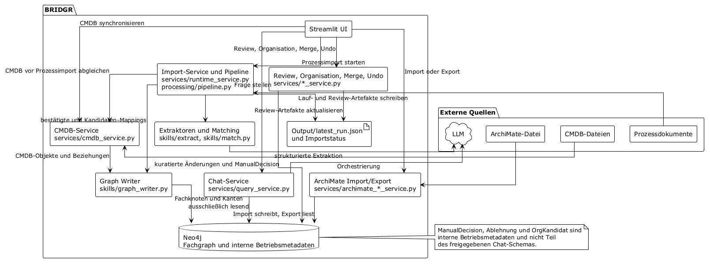
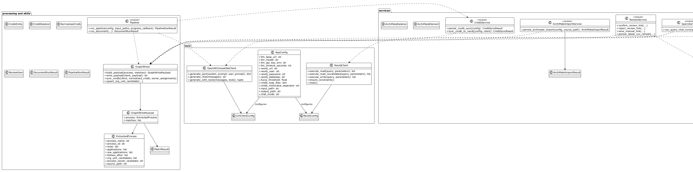
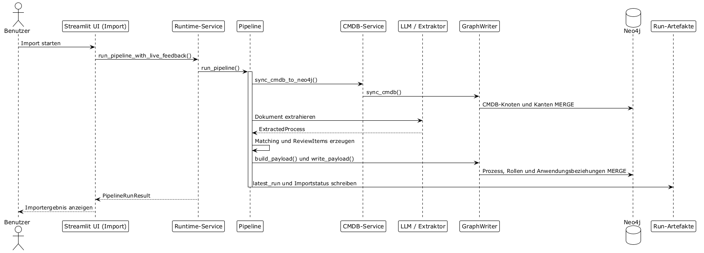
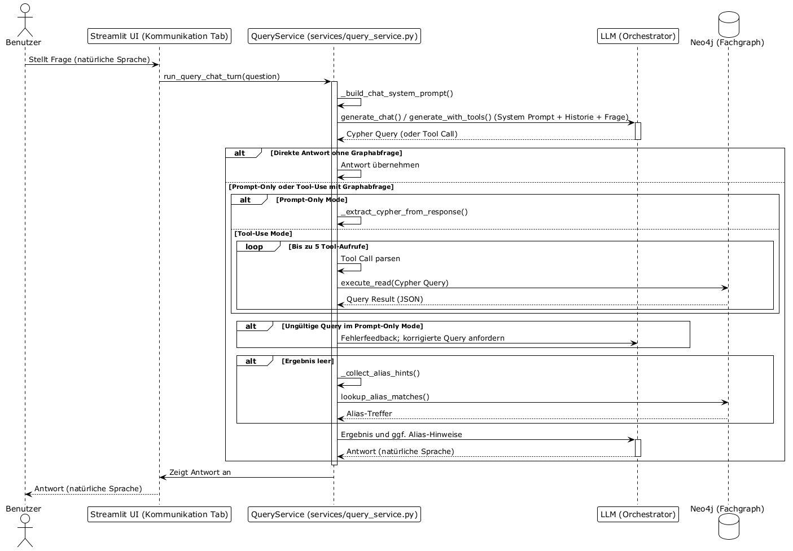
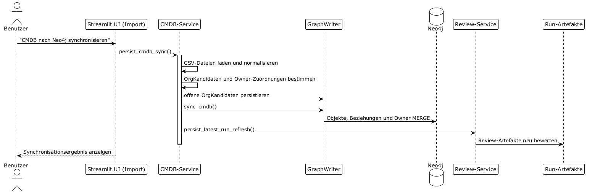
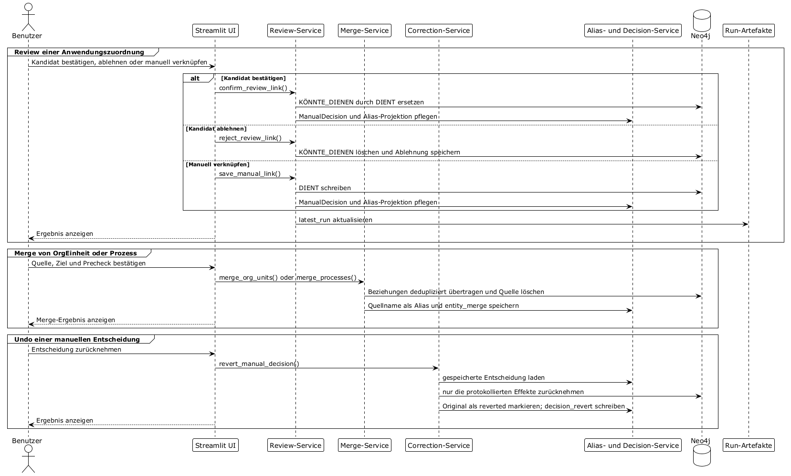

# Bridgr

**EA-Wissensgraph mit Entscheidungs- und Konsolidierungsschicht** | Stand: August 2026 | v0.28

---

## 1. Ziel

BRIDGR fuehrt Prozessdokumentation, CMDB-Exporte und ArchiMate-Modelle in einem
gemeinsamen Enterprise-Architecture-Wissensgraphen zusammen und macht diesen ueber
eine natuerlichsprachliche Web-Oberflaeche auswertbar.

Kernfrage:
Welche IT-Bausteine unterstuetzen welche Geschaeftsprozesse und wie sicher wissen wir das?

### 1.1 Visionsziel: vollwertiger EA-Chatbot

Der Tab `Kommunikation` ist kein reiner Query-Editor, sondern ein vollwertiger
Unternehmens-Architektur-Chatbot. Benutzer stellen Fragen in natuerlicher Sprache zu
Prozessen, Anwendungen, Verantwortlichkeiten, Risiken, Zielen und Abhaengigkeiten.
BRIDGR beantwortet diese Fragen auf Basis des Wissensgraphen, nicht aus allgemeinem
Weltwissen.

Dieses Visionsziel ist der Massstab fuer alle Designentscheidungen im Abfrage-Layer.

### 1.2 Architekturleitlinien

- Neo4j ist die kanonische Laufzeitquelle fuer den EA-Graphen und fuer persistierte
  Entscheidungen.
- Der Importpfad bleibt sequentiell, nachvollziehbar und idempotent.
- Fachgraph, Review-/Korrekturlogik und UI-Orchestrierung bleiben sauber getrennt.
- Unsichere Informationen werden explizit als unsicher modelliert oder als offene
  Review-Faelle behandelt.
- Manuelle Korrekturen muessen gezielt rueckabwickelbar sein.

---

## 2. Gesamtarchitektur

BRIDGR besteht aus vier logisch getrennten Schichten:

1. **Import- und Extraktionsschicht**
   Prozessdokumente, CMDB-Dateien und ArchiMate-Dateien werden gelesen, analysiert und
   in strukturierte Zwischenobjekte ueberfuehrt.

2. **Schreib- und Konsolidierungsschicht**
   Der `GraphWriter` und zugehoerige Services schreiben den Fachgraphen in Neo4j,
   fuehren Identitaetsaufloesung durch und pflegen persistente Review-Entscheidungen.

3. **Entscheidungs- und Korrekturschicht**
   Benutzerentscheidungen wie Bestaetigung, Ablehnung, manuelle Zuordnung, Ruecknahme
   und Dubletten-Merge werden als separate Betriebsmetadaten modelliert, damit sie
   nachvollziehbar und selektiv rueckgaengig gemacht werden koennen.

4. **Abfrage- und UI-Schicht**
   Streamlit rendert die Arbeitsoberflaeche. Ein LLM fungiert im Chat als Orchestrator
   fuer read-only Cypher-Abfragen auf den Fachgraphen.

### 2.1 Hauptdatenfluss

```text
Prozessdokumente / CMDB / ArchiMate
        |
        v
Extraktion / Normalisierung / Matching
        |
        v
Review-Artefakte + Fachentscheidungen
        |
        v
Neo4j-Fachgraph + Neo4j-Entscheidungsgraph
        |
        v
Streamlit-UI + Chat-Layer
```

### 2.2 Kanonische Quellen

- **Neo4j-Fachgraph**
  enthaelt fachliche Objekte und Beziehungen, die fuer Analyse, Chat und Export relevant sind.
- **Neo4j-Entscheidungsgraph**
  enthaelt betriebliche Korrektur- und Auditobjekte fuer manuelle Entscheidungen.
- **`archimate_mapping.json`**
  enthaelt alle konfigurierbaren ArchiMate-Mappings.
- **`Output/latest_run.json`**
  ist ein UI-Artefakt fuer Review und Transparenz, nicht die kanonische Wahrheitsquelle.

---

## 3. Inputs und Dateifluss

### 3.1 Eingangsdateien

- Prozessdokumente als BPMN, TXT, DOCX oder PDF
- transformierte BPMN-TXT-Dateien aus grossen XML-Modellen
- CMDB-Exportdateien als CSV, eine Datei pro Objektart (Anwendungen, Server, Schnittstellen)
- ArchiMate-Modelle im Exchange Format 3.0 oder 3.1 als `.xml` oder `.archimate`

### 3.2 Inbox-Prinzip

`Input/` ist die Arbeits-Inbox fuer neue Dateien. Verarbeitete Prozessdateien bleiben
nicht dauerhaft dort liegen.

### 3.3 Archivierung

Verarbeitete Prozessdateien werden nach erfolgreichem Lauf nach
`data/input_archive/<timestamp>/` verschoben.

### 3.4 Laufmodi

- `full`: alle Prozessdateien in `Input/`
- `partial`: nur explizit ausgewaehlte Dateien

CMDB-Synchronisation und ArchiMate-Import/-Export werden separat ausgeloest.

---

## 4. Scope

| Bereich | In Scope | Out of Scope |
| --- | --- | --- |
| Eingabeformate | BPMN, TXT, DOCX, PDF, CSV-CMDB (pro Objektart), ArchiMate 3.0/3.1 | weitere Office-/CMDB-Formate |
| UI | Streamlit mit 6 Tabs (Kommunikation, Import, Zuordnungen, Organisation, EA-Modell, Konfiguration) | eigenstaendige CLI-Review |
| Chat | LLM-Orchestrierung mit Tool-Use und Prompt-Only-Fallback | Agenten-Orchestrierung |
| Graph | Neo4j als Fach- und Entscheidungsgraph | alternatives Graph-Backend |
| Review | manuelle Zuordnung, Ablehnung, Ruecknahme, Merge | externes Ticketing |
| ArchiMate | Import, Export, Mapping-Konfiguration, Kandidaten-Review | Views/Viewpoints |
| Konsolidierung | Merge fuer `OrgEinheit` und `Prozess`, spaeter erweiterbar | generischer Merge beliebiger Labels |

---

## 5. Domaenenmodell

### 5.1 Fachknoten

#### Prozess

Geschaeftsprozess aus Prozessdokumenten oder ArchiMate. Fachliche Primaeridentitaet aus
`prozess_id`, sofern vorhanden. Zusaetzlich kann `archimate_id` existieren.

#### Anwendung

CMDB-Anwendung oder ArchiMate-Anwendungsobjekt. Fachliche Primaeridentitaet ist `cmdb_id`,
falls vorhanden.

#### Schnittstelle

Separat gefuehrter Integrations- oder Uebergabepunkt.

#### Server

Physischer oder virtueller Infrastrukturknoten mit `server_type`.

#### OrgEinheit

Reale organisatorische Einheit. Entsteht durch manuelle Pflege, bestaetigte Kandidaten,
CMDB-Owner-Aufloesung oder ArchiMate-Import.

#### Rolle

Prozessteilnehmer auf Prozessebene, typischerweise aus BPMN-Lanes. Eine Rolle ist keine
OrgEinheit und impliziert keine Verantwortung.

#### Alias

Deterministische alternative Bezeichnung fuer `Anwendung` oder `OrgEinheit`. Dient der
Identitaetsaufloesung in Pipeline und Chat.

#### Stakeholder

Interessengruppe oder Partei aus dem Motivation-Layer.

#### Faehigkeit

Strategische oder operative Faehigkeit.

#### Ressource

Genutzte Ressource.

#### Ziel

Explizit modelliertes Ziel, Outcome, Meaning oder Value.

#### Anforderung

Normative Vorgabe, Constraint oder Principle.

#### Kontext

Externer Einflussfaktor oder Assessment.

#### Risiko

Explizit modelliertes Risiko.

#### Datenobjekt

Daten- oder Informationsobjekt.

#### Infrastruktur

Technologische Infrastruktur unterhalb der Anwendungsschicht.

#### Ablehnung

Persistente Ablehnungsmarke fuer eine extrahierte Bezeichnung in einem konkreten Prozess.
Sie dient der Unterdrueckung erneuter Vorschlaege.

#### OrgKandidat

Interner Betriebsknoten fuer eine unaufgeloeste OrgEinheit-/Rollen-Nennung aus Prozessimport
oder CMDB-Sync (`status`: `open`, `mapped` oder `rejected`; `mapped_org_unit` bei `mapped`).
Ersetzt seit der vollstaendigen Ablösung von `kb.json` (Finding #15) den frueheren
`org_unit_candidates`-Abschnitt der Wissensbasis-Datei. Wie `ManualDecision` und `Ablehnung`
bewusst nicht Teil des Query-Schemas fuer den Chat-Layer.

### 5.2 Fachbeziehungen

```text
(:Anwendung)-[:DIENT]->(:Prozess)
(:Anwendung)-[:KÖNNTE_DIENEN]->(:Prozess)
(:Rolle)-[:BETEILIGT_AN]->(:Prozess)
(:OrgEinheit)-[:KANN_EINNEHMEN]->(:Rolle)
(:OrgEinheit)-[:VERANTWORTET]->(:Prozess|:Anwendung|:Schnittstelle|:Server|:Infrastruktur)
(:Prozess)-[:FOLGT_AUF]->(:Prozess)
(:Anwendung)-[:USES_INTERFACE]->(:Schnittstelle)
(:Anwendung|:Schnittstelle)-[:RUNS_ON]->(:Server)
(:Alias)-[:KANN_MEINEN]->(:Anwendung|:OrgEinheit)
(:Risiko)-[:BETRIFFT]->(...)
(:Faehigkeit|:Anwendung)-[:MITIGIERT]->(:Risiko)
(:Faehigkeit|:Anforderung)-[:REALISIERT]->(...)
(:Prozess|:Anwendung)-[:BENOETIGT]->(:Ressource)
(:Prozess|:Anwendung)-[:UNTERSTUETZT]->(:Ziel|:Faehigkeit)
(:Prozess|:Anwendung)-[:VERARBEITET]->(:Datenobjekt)
(:Anwendung)-[:LAEUFT_AUF]->(:Infrastruktur)
(:Kontext|:Anforderung)-[:BEEINFLUSST]->(...)
(:Stakeholder|:OrgEinheit)-[:IST_VERBUNDEN_MIT]->(...)
```

### 5.3 Wichtige Properties

#### Auf `:DIENT`

- `konfidenz`
- `source`
- `raw_name`

#### Auf `:KÖNNTE_DIENEN`

- `score`

#### Auf ArchiMate-importierten Knoten

- `archimate_id`
- `archimate_source`
- `archimate_type`

#### Auf ArchiMate-importierten Relationen

- `archimate_rel_type`

#### Auf `:Rolle`

- `role_only`

---

## 6. Anwendungsschichten und Module

```text
bridgr/
├── core/          # Konfiguration, LLM-Client, Neo4j, Query-Schema
├── processing/    # Pipeline, CMDB, Import-Hilfen, Laufartefakte
├── prompts/       # Extraktions- und Chat-Prompts
├── skills/        # GraphWriter, Matching, Extraktion
├── services/      # UI-seitig aufgerufene Orchestrierung
├── ui/            # Streamlit-Tabs
├── data/          # archimate_mapping.json, Archive
├── Input/
├── Output/
├── config.json
├── app.py
└── main.py
```

### 6.1 Hauptverantwortlichkeiten

- `processing/pipeline.py`
  orchestriert Dokumentlauf, Matching und Schreibpayloads
- `skills/graph_writer.py`
  kapselt den fachlichen Schreibzugriff auf Neo4j
- `services/review_service.py`
  kapselt Review-Aktionen fuer Anwendungszuordnungen
- `services/organization_service.py`
  kapselt Org-, Owner- und Rollenpflege
- `services/query_service.py`
  baut den dynamischen Chat-Systemprompt und fuehrt den Dialogturn aus
- `services/archimate_import_service.py` / `services/archimate_export_service.py`
  kapseln ArchiMate-Import und -Export

---

## 7. Importlogik

### 7.1 Prozessdokumente

Jedes Prozessdokument durchlaeuft diese Kette:

1. Dateityp-spezifische Textgewinnung
2. LLM-Extraktion oder BPMN-strukturelle Extraktion
3. Matching gegen CMDB und bestaetigte Entscheidungen
4. Erzeugung von Review-Artefakten
5. Aufbau eines `GraphWritePayload`
6. Schreiben nach Neo4j

### 7.2 Matching-Reihenfolge

1. bestaetigte Entscheidungen aus Neo4j
2. abgelehnte Entscheidungen aus Neo4j
3. Alias-Aufloesung
4. Fuzzy Matching
5. offen / manuelle Klaerung

### 7.3 Konfidenzmodell

- `stark`
  bestaetigt oder sicher gematcht, wird als `DIENT` bzw. `VERANTWORTET` geschrieben
- `schwach`
  Anwendungskandidat mit Review-Bedarf, wird als `KÖNNTE_DIENEN` geschrieben; unsichere
  CMDB-Owner werden als `OrgKandidat` gefuehrt (kein direkter Kanten-Schreibpfad)
- `offen`
  kein Match, nur Review-Artefakt

### 7.4 Re-Import-Verhalten

- fachliche Importkanten werden pro Prozess bzw. pro CMDB-Sync deterministisch aktualisiert
- persistente manuelle Entscheidungen muessen ueber Re-Importe hinweg erhalten bleiben
- bestaetigte oder manuell angelegte Zuordnungen duerfen nicht durch bloesses
  Verschwinden eines Rohbegriffs im Quelldokument verloren gehen

### 7.5 CMDB-Import-Format

#### 7.5.1 Eingabemodell

CMDB-Daten werden als eine CSV-Datei pro Objektart eingelesen:

- eine Datei fuer Anwendungen
- eine Datei fuer Server
- eine Datei fuer Schnittstellen

Jede Datei enthaelt nur Eintraege eines einzigen Typs. Die Zuordnung von Dateinamen zu
Objektarten wird explizit in `config.json` unter `cmdb_type_files` konfiguriert.
Fehlt ein Eintrag fuer einen Typ, wird dieser Typ beim Sync uebersprungen.

Beispielkonfiguration:

```json
"cmdb_type_files": {
  "application": "Anwendungen.csv",
  "server": "Server.csv",
  "interface": "Schnittstellen.csv"
}
```

#### 7.5.2 Beziehungen in Typ-Dateien

Beziehungen zwischen Objekten werden als Spalten in der Quelldatei des Quellobjekts
abgelegt. Mehrere Ziel-IDs werden durch den konfigurierten Mehrwert-Trennzeichen getrennt
(Standard: `|`, konfigurierbar ueber `cmdb_multivalue_separator` in `config.json`).

In der Anwendungsdatei stehen typischerweise:

- `runs_on`: semikolon- oder pipetrennte Liste von Server-IDs (konfigurierbar: `cmdb_runs_on_column`)
- `uses_interfaces`: semikolon- oder pipetrennte Liste von Schnittstellen-IDs (konfigurierbar: `cmdb_uses_interfaces_column`)

Server- und Schnittstellendateien enthalten keine Beziehungsspalten.

Beispiel Anwendungsdatei:

```csv
id;name;owner_name;runs_on;uses_interfaces
APP-001;SAP S/4HANA FI;Buchhaltung;SRV-001;IF-001|IF-015
```

#### 7.5.3 Gemeinsame Pflichtspalten

Alle Typ-Dateien teilen dieselben konfigurierbaren Spaltennamen fuer ID, Name und
Besitzer (`cmdb_uuid_column`, `cmdb_name_column`, `cmdb_owner_name_column`). Nur
Serverdateien verwenden zusaetzlich `cmdb_server_type_column`.

#### 7.5.4 Internes Datenmodell

Der Loader erzeugt aus allen Typ-Dateien gemeinsam ein `NormalizedCmdb`-Objekt mit:

- `entities`: Liste aller `CmdbEntity`-Objekte aller Typen
- `relations`: Liste aller `CmdbRelation`-Objekte aus den Beziehungsspalten

Der `GraphWriter` bleibt unveraendert und kennt nur das `NormalizedCmdb`-Interface.

#### 7.5.5 Rueckwaertskompatibilitaet

Ist `cmdb_type_files` in `config.json` leer oder nicht gesetzt, faellt BRIDGR auf das
Legacy-Format zurueck:

- eine gemischte Entities-Datei (konfiguriert ueber `cmdb_filename`) mit einer `entity_type`-Spalte
- eine optionale separate Relationsdatei (konfiguriert ueber `cmdb_relations_filename`)

Das Legacy-Format ist weiterhin voll funktionsfaehig, aber als Entwicklungsformat
eingestuft. Produktive CMDB-Anbindungen sollen das Typ-Datei-Format verwenden.

---

## 8. Matching, Review und Persistenz

### 8.1 Bestaetigen eines schwachen Anwendungskandidaten

Beim Bestaetigen einer `KÖNNTE_DIENEN`-Kante:

1. wird die schwache Kante geloescht
2. wird eine starke `DIENT`-Kante geschrieben
3. wird `raw_name` auf der `DIENT`-Kante gesetzt
4. wird bei abweichendem Begriff ein `Alias` auf die Anwendung geschrieben
5. wird die Anzeige in `latest_run.json` gezielt aktualisiert

### 8.2 Ablehnen eines Anwendungskandidaten

Beim Ablehnen:

1. wird die `KÖNNTE_DIENEN`-Kante geloescht
2. wird ein `(:Ablehnung)`-Knoten geschrieben
3. wird der Begriff bei naechsten Laeufen nicht erneut vorgeschlagen

### 8.3 Manuelle Zuordnung einer Anwendung

Bei manueller Zuordnung im Review-Tab:

1. wird direkt eine starke `DIENT`-Kante geschrieben
2. bleibt die Entscheidung ueber Re-Importe hinweg persistent
3. muss die Entscheidung spaeter gezielt ruecknehmbar sein

### 8.4 Owner- und Rollenzuordnungen

- `VERANTWORTET` fuer Prozesse und CMDB-Ziele wird nur explizit oder ueber exakte
  Owner-Aufloesung geschrieben
- `KANN_EINNEHMEN` entsteht nur ueber Benutzeraktion

---

## 9. Graph Writer

### 9.1 Rolle

`GraphWriter` ist die einzige fachliche Schreibkomponente fuer Neo4j. Er:

- normalisiert Identitaeten
- schreibt Prozess-, CMDB- und Review-Kanten
- kapselt Promote-/Reject-Operationen
- laedt persistente Entscheidungen fuer Re-Importe
- fuehrt begrenzte Cross-Source-Identitaetsaufloesung durch

### 9.2 Idempotenz

Alle regulaeren Schreibpfade sind auf wiederholte Ausfuehrung ausgelegt:

- `MERGE` fuer Knoten und stabile Fachbeziehungen
- prozessbezogene Loeschung und Wiederaufbau fuer volatile Importkanten
- Erhalt persistenter manueller Entscheidungen ueber Wiedereinpielen

### 9.3 Cross-Source-Identitaetsaufloesung

Bereits heute existieren gezielte Anreicherungen statt blindem Duplikatbau:

- BPMN-/Dokumentprozess auf vorhandenen Prozess ohne `prozess_id`
- CMDB-Anwendung auf vorhandene ArchiMate-Anwendung ohne `cmdb_id`
- case-insensitive Kanonisierung fuer `OrgEinheit`

### 9.4 Grenzen des aktuellen Writers

Der aktuelle Writer schreibt Fachgraph und Teilentscheidungen, hat aber noch keine
vollstaendige Korrekturschicht fuer:

- Undo manueller Entscheidungen
- Merge von Dubletten mit Auditspur
- Alias-Lifecycle bei Ruecknahmen

Diese Faehigkeiten werden in Abschnitt 10 spezifiziert.

---

## 10. Entscheidungs- und Korrekturschicht

### 10.1 Ziel

Benutzer muessen manuelle Eingriffe nachvollziehbar, selektiv und sicher rueckgaengig
machen koennen. Gleichzeitig muessen fachliche Dubletten aus unterschiedlichen Quellen
gezielt konsolidierbar sein.

### 10.2 Grundprinzip

Der Fachgraph bleibt vom Entscheidungsgraph getrennt.

- Der **Fachgraph** enthaelt Objekte wie `Prozess`, `Anwendung`, `OrgEinheit`, `Alias`.
- Der **Entscheidungsgraph** enthaelt Betriebsmetadaten fuer manuelle Eingriffe.

### 10.3 Entscheidungsknoten

Neuer interner Knotentyp:

```text
(:ManualDecision)
```

Pflichtattribute:

- `decision_id`
- `decision_type`
- `status`
- `created_at`
- `payload_json`

Optionale Attribute:

- `supersedes_decision_id`
- `reverted_at`
- `notes`

### 10.4 Implementierter Umsetzungsstand (Ist-Zustand)

`ManualDecision` wird als isolierter Knoten ohne Kanten zu den betroffenen Fachobjekten
persistiert. Die Zuordnung betroffener Objekte (Prozess, Anwendung, OrgEinheit, Rolle usw.)
erfolgt ausschliesslich ueber das Feld `payload_json`, das die relevanten IDs und Namen
als JSON-String enthaelt.

Ruecknahmen (`decision_revert`) referenzieren die urspruengliche Entscheidung ebenfalls
ueber `supersedes_decision_id` im Payload, nicht ueber eine Graph-Kante.

Die Rücknahme-Logik parst das Payload im Speicher und setzt ad-hoc-Cypher-Statements ab,
um die urspruenglichen Graphaenderungen rueckgaengig zu machen.

### 10.4a Zukunftsperspektive: Explizite Betriebsrelationen

Architektonisch vorgesehen, aber derzeit nicht implementiert sind explizite Kanten:

```text
(:ManualDecision)-[:AFFECTS]->(:Prozess)
(:ManualDecision)-[:AFFECTS]->(:Anwendung)
(:ManualDecision)-[:AFFECTS]->(:OrgEinheit)
(:ManualDecision)-[:AFFECTS]->(:Rolle)
(:ManualDecision)-[:CREATED_ALIAS]->(:Alias)
(:ManualDecision)-[:SUPERSEDES]->(:ManualDecision)
```

Diese Kanten wuerden rein betriebliche Metadaten abbilden und keine fachlichen EA-Beziehungen
darstellen. Eine Migration dorthin ist moeglich, sobald die Payload-Variante nicht mehr
ausreicht (z. B. fuer komplexe Auditing-Anforderungen).

### 10.5 Entscheidungstypen

Geplante `decision_type`-Werte:

- `manual_link`
- `confirmed_candidate_link`
- `manual_process_owner_assignment`
- `manual_role_assignment`
- `candidate_owner_confirmation`
- `entity_merge`
- `decision_revert`

### 10.6 Sichtbarkeit im Chat-Layer

`ManualDecision` und zugehoerige betriebliche Relationen sind **nicht Teil des
freigegebenen Query-Schemas**.

Konsequenzen:

- `core/graph_schema.py` bleibt allowlist-basiert
- `build_query_schema_reference()` nimmt `ManualDecision` nicht auf
- der dynamisch erzeugte Systemprompt erwaehnt diese Knoten nicht
- das LLM kann den Entscheidungsgraph weder absichtlich noch versehentlich abfragen

Der Chat beantwortet nur fachliche Fragen auf Basis des Fachgraphen.

### 10.7 Undo manueller Entscheidungen

Jede manuelle Aktion mit fachlicher Wirkung erzeugt genau einen `ManualDecision`-Knoten.
Eine Ruecknahme:

1. referenziert die urspruengliche Entscheidung
2. entfernt nur die konkret von dieser Entscheidung verursachten Graphaenderungen
3. aktualisiert abhaengige UI-Artefakte gezielt
4. hinterlaesst selbst wieder eine persistente Auditspur

Aktueller Umsetzungsstand:

- Ruecknahme ist fuer `manual_link`, `confirmed_candidate_link`,
  `manual_process_owner_assignment` und `manual_role_assignment` implementiert.
- Die Ruecknahme arbeitet aktuell payload-basiert und setzt den urspruenglichen
  Entscheidungsknoten auf `status = reverted`.
- Zusaetzlich wird eine neue `ManualDecision` vom Typ `decision_revert` geschrieben.
- Der Ruecknahme-Eintrag dient als Auditspur und wird selbst nicht als neue aktive
  Fachentscheidung behandelt.

### 10.8 Ruecknahmesichere Faelle

In Scope fuer die erste Ausbaustufe:

- manueller `DIENT`-Link
- bestaetigter `KÖNNTE_DIENEN`-Link
- manuelle Prozess-Owner-Zuordnung
- manuelle Rollenzuordnung

### 10.9 Nicht-Ziel

Kein globales Snapshot-Restore der Datenbank.

---

## 11. Konsolidierungsschicht fuer Dubletten

### 11.1 Ziel

BRIDGR muss fachliche Dubletten zusammenfuehren koennen, auch wenn kein manueller Fehler
den Zustand verursacht hat.

Typische Faelle:

- `OrgEinheit`: unterschiedliche Schreibweisen oder manuell falsch angelegte Einheiten
- `Prozess`: identischer Prozess aus TXT und BPMN unter leicht abweichenden Namen
- spaeter optional `Anwendung`

### 11.2 Mergebare Labels

Erste Ausbaustufe:

- `OrgEinheit`
- `Prozess`

### 11.3 Merge-Ziele

Ein Merge soll:

1. einen Quellknoten in einen Zielknoten konsolidieren
2. alle relevanten Beziehungen auf den Zielknoten uebertragen
3. doppelte Beziehungen vermeiden
4. die Quellbezeichnung als Alias auf dem Ziel bewahren
5. den Quellknoten loeschen
6. den Merge als `ManualDecision` dokumentieren

### 11.4 Alias-Fortschreibung

Bei jedem Merge gilt:

- Die Quellbezeichnung wird als Alias des Zielknotens weitergefuehrt, sofern sie nach
  Normalisierung nicht identisch mit dem Zielnamen ist.
- Dadurch bleibt der Begriff aus den Quelldokumenten fuer spaetere Re-Importe und
  Chat-Aufloesung erhalten.

Ohne diese Alias-Fortschreibung wuerde derselbe Rohbegriff beim naechsten Import erneut
zu einer Dublette fuehren.

### 11.5 Beziehungsuebernahme

Beim Merge werden eingehende und ausgehende Beziehungen des Quellknotens auf den Zielknoten
umgehaengt, soweit der Typ fuer das betroffene Label fachlich erlaubt ist.

### 11.6 Beziehungsdeduplizierung

Beziehungsuebernahme ist niemals blind.

Regel:

- Wenn am Ziel bereits eine gleichartige Beziehung mit identischem Gegenspieler und
  identischer Richtung existiert, wird keine zweite Kante erzeugt.
- Falls beide Beziehungen Properties tragen, gilt eine konfliktarme Konsolidierungsregel:
  - bestaetigte/starke Information gewinnt vor schwacher
  - vorhandene IDs und ArchiMate-Metadaten bleiben erhalten
  - redundante Duplikate werden verworfen

### 11.7 Merge von `OrgEinheit`

Zu beruecksichtigende Fachbeziehungen:

- ausgehend: `VERANTWORTET`, `KANN_EINNEHMEN`, `IST_VERBUNDEN_MIT`
- eingehend ueber Alias: `(:Alias)-[:KANN_MEINEN]->(:OrgEinheit)`
- betriebliche Metadaten aus `ManualDecision`

Aktueller Umsetzungsstand:

- Der Backend-Merge fuer `OrgEinheit` ist implementiert.
- Kantenuebernahme erfolgt derzeit fuer `VERANTWORTET`, `KANN_EINNEHMEN`,
  ausgehendes `IST_VERBUNDEN_MIT` sowie bestehende eingehende Alias-Kanten.
- Die Deduplizierung erfolgt aktuell ueber `MERGE` auf den Zielkanten.
- Eine weitergehende Property-Konsolidierung ist fuer diese erste Ausbaustufe noch
  nicht erforderlich und daher noch nicht separat implementiert.

### 11.8 Merge von `Prozess`

Zu beruecksichtigende Fachbeziehungen:

- eingehend: `DIENT`, `KÖNNTE_DIENEN`, `BETEILIGT_AN`, `VERANTWORTET`, `REALISIERT`,
  `UNTERSTUETZT`, `BENOETIGT`, `VERARBEITET`, `BETRIFFT`, `BEEINFLUSST`
- ausgehend: `FOLGT_AUF`, `UNTERSTUETZT`, `BENOETIGT`, `VERARBEITET`
- zusaetzliche Konsolidierung von `prozess_id`, `archimate_id`, `archimate_type`

Aktueller Umsetzungsstand:

- Der Backend-Merge fuer `Prozess` ist implementiert.
- Bestehende gleichartige Beziehungen am Ziel werden nicht doppelt angelegt.
- Der Quellname wird als Alias des Zielprozesses weitergefuehrt.
- Die Ruecknahme arbeitet snapshot-basiert ueber die im Merge-Payload gespeicherten
  Knoten- und Beziehungshinweise.

### 11.9 Merge-Precheck

Vor jedem Merge zeigt die UI:

- Quell- und Zielobjekt
- Quellenhinweise
- Anzahl eingehender/ausgehender Beziehungen
- potentielle Konflikte
- Alias, der entstehen wuerde

Erst danach darf der Merge explizit bestaetigt werden.

Aktueller Umsetzungsstand:

- Im UI existieren Merge-Bereiche fuer `OrgEinheit` und `Prozess`.
- Der Precheck zeigt bereits Quell-/Zielobjekt, Anzahl ein- und ausgehender Kanten,
  Dubletten am Ziel, Alias-Uebernahme sowie erkannte Property-Konflikte.
- Zusaetzlich wird eine kompakte Wirkungszusammenfassung angezeigt
  (zu uebertragende Kanten, nicht doppelt anzulegende Kanten, Verhalten bei Konflikten).
- Weitere Verfeinerungen der Visualisierung sind moeglich, aber keine funktionale
  Voraussetzung mehr fuer die erste Ausbaustufe.

---

## 12. Abfrage-Layer

### 12.1 Architekturprinzip

Der LLM ist Orchestrator fuer fachliche Graphabfragen. Er erzeugt read-only Cypher auf
Basis eines dynamisch zusammengesetzten, aber allowlist-basierten Schemas.

### 12.2 Dynamischer Systemprompt

`services/query_service.py` baut den Chat-Prompt aus:

- `prompts/chat_system.md`
- Query-Protokoll (`tool-use` oder `prompt-only`)
- `build_archimate_mapping_reference()`
- `build_query_schema_reference()`

Das Schema ist nicht datenbankintrospektiv, sondern wird aus `core/graph_schema.py`
aufgebaut. Dadurch lassen sich interne Knotentypen wie `ManualDecision` ohne Verrenkungen
ausserhalb des Chat-Schemas halten.

### 12.3 Query-Sicherheit

- nur read-only Cypher
- Validator prueft Labels, Relationen, Richtungen und Properties
- `IST_VERBUNDEN_MIT` ist als Ausnahme ohne Labelpaarbeschraenkung erlaubt
- interne Knoten wie `Ablehnung`, `ManualDecision` und `OrgKandidat` sind nicht freigegeben

### 12.4 Alias-Nutzung im Chat

Alias-Knoten unterstuetzen:

- deterministische Aufloesung alternativer Begriffe
- Rueckgriff bei leeren Treffern
- Robustheit gegen unterschiedliche Schreibweisen und Merge-Folgen

### 12.5 Unsicherheit im Chat

Der Chat darf bestaetigte Fakten und unbestaetigte Kandidaten unterscheiden:

- `DIENT` / `VERANTWORTET` = bestaetigte Fakten
- `KÖNNTE_DIENEN` = nicht bestaetigte Kandidaten

Entscheidungsmetadaten selbst sind kein Chat-Gegenstand.

---

## 13. UI-Architektur

### 13.1 Tab `Kommunikation`

- Chat mit Verlauf
- LLM-Orchestrierung
- technische Fehleruebersetzung in Klartext

### 13.2 Tab `Zuordnungen`

- Review offener und schwacher Anwendungszuordnungen
- Bestaetigen, Ablehnen, manuelle Zuordnung
- Ruecknahme zuletzt getroffener Entscheidungen ist in der aktuellen Ausbaustufe noch
  nicht im Tab `Zuordnungen`, sondern zentral im Tab `Organisation` umgesetzt

### 13.3 Tab `Konfiguration`

- Pfade
- CMDB-Typ-Dateien-Mapping (`cmdb_type_files`): eine Datei pro Objektart
- CMDB-Spaltenmapping (ID, Name, Besitzer, Servertyp, Beziehungsspalten)
- Mehrwert-Trennzeichen fuer CMDB-Beziehungsspalten (`cmdb_multivalue_separator`)
- Import-/Matching-Einstellungen
- LLM- und Neo4j-Konfiguration

### 13.4 Tab `Organisation`

- Pflege von OrgEinheiten
- Kandidaten-Mapping
- Prozess-Owner-Zuordnung
- Rollenzuordnung
- zentrale Ruecknahme manueller Entscheidungen
- Merge-Verwaltung fuer `OrgEinheit` und `Prozess`

### 13.5 Tab `EA-Modell`

- ArchiMate-Mapping
- ArchiMate-Import
- ArchiMate-Export
- Review offener ArchiMate-Kandidaten

### 13.6 Zukuenftige UI-Erweiterungen fuer Korrekturschicht

Zusaetzliche Bedienbereiche:

- `Letzte manuelle Änderungen`
- `Entscheidung zurücknehmen`
- `Objekte konsolidieren`
- Merge-Precheck mit Konfliktanzeige

Aktueller Umsetzungsstand:

- `Letzte manuelle Änderungen` und `Entscheidung zurücknehmen` sind im
  Organisation-Tab bereits vorhanden.
- `Objekte konsolidieren` ist fuer `OrgEinheit` und `Prozess` vorhanden.
- Der Merge-Precheck zeigt bereits fachlich relevante Wirkungen und Konflikte.
- Offen bleiben nur moegliche spaetere UX-Verfeinerungen oder die Erweiterung auf
  weitere Objektarten.

---

## 14. Konfiguration

### 14.1 `config.json`

Zentrale Laufzeitkonfiguration fuer:

- Pfade
- LLM
- Neo4j
- Matching-Schwellwerte
- CMDB-Konfiguration:
  - `cmdb_type_files`: Mapping von Objektart (`application`, `server`, `interface`) auf Dateinamen
  - `cmdb_uuid_column`, `cmdb_name_column`, `cmdb_owner_name_column`, `cmdb_server_type_column`: gemeinsame Spalten aller Typ-Dateien
  - `cmdb_runs_on_column`: Spaltenname fuer Server-IDs in der Anwendungsdatei (Standard: `runs_on`)
  - `cmdb_uses_interfaces_column`: Spaltenname fuer Schnittstellen-IDs in der Anwendungsdatei (Standard: `uses_interfaces`)
  - `cmdb_multivalue_separator`: Trennzeichen fuer Mehrfachwerte (Standard: `|`)
  - `cmdb_filename`, `cmdb_relations_filename`: Legacy-Felder fuer das Zwei-Dateien-Format, werden ignoriert wenn `cmdb_type_files` gesetzt ist
- Chat-Modus

### 14.2 `archimate_mapping.json`

Enthaelt:

- `elements.import`
- `elements.ignore`
- `elements.export`
- `relationships.import`
- `relationships.export`
- `relationships.bridgr_relation`
- `pending_candidates`

### 14.3 Konfigurationsprinzip

Organisationsspezifisches Mapping-Wissen gehoert in JSON-Konfiguration, nicht in den Code.

---

## 15. ArchiMate-Integration

### 15.1 Import

Der Import:

- erkennt 3.0 und 3.1 automatisch ueber den Root-Namespace
- mappt Elementtypen ueber `archimate_mapping.json`
- fuehrt exakte Identitaetsanreicherung oder Fuzzy-Kandidatenbildung durch
- schreibt Relationen nur bei konfiguriertem `bridgr_relation`
- protokolliert uebersprungene Typen und Relationen

### 15.2 Export

Der Export:

- exportiert den vollstaendigen BRIDGR-Graphen
- verwendet fuer importierte Knoten/Relationen deren originale ArchiMate-Typen
- verwendet fuer BRIDGR-native Knoten/Relationen die konfigurierten kanonischen Typen
- fuehrt vor Export einen Typ-Precheck fuer untypisierte Knoten durch

### 15.3 ArchiMate und Konsolidierung

Merge- und Alias-Entscheidungen muessen so gestaltet sein, dass:

- ArchiMate-Importe keine bereits konsolidierten Fachobjekte wieder aufspalten
- Quellbezeichnungen als Alias erhalten bleiben
- `archimate_id` und `archimate_type` bei Konflikten bewusst konsolidiert werden

---

## 16. UML-Diagramme

### 16.1 Komponentendiagramm

Zeigt die logischen Komponenten und ihre Abhaengigkeiten.



### 16.2 Klassenmodell

Zeigt die zentralen konkreten Klassen und die modulbasierten Funktionsgrenzen, gegliedert nach Konfiguration,
Verarbeitung & Skills sowie Services und ArchiMate-Integration.



### 16.3 Sequenzdiagramme

Zeigt die wichtigsten Ablaeufe als Sequenzdiagramme.









---

## 17. Nichtfunktionale Anforderungen

### 17.1 Nachvollziehbarkeit

Alle manuellen Eingriffe muessen auditierbar sein.

### 17.2 Idempotenz

Wiederholte Importe duerfen keine unkontrollierten Duplikate erzeugen.

### 17.3 Geringe Seiteneffekte

UI-Aktionen sollen gezielt nur die betroffenen Prozesse, Kandidaten oder Knoten aktualisieren.

### 17.4 Trennung von Fach- und Betriebsmetadaten

Der Chat darf nur den Fachgraphen sehen. Betriebsmetadaten bleiben intern.

---

## 18. Akzeptanzkriterien

1. Korrekte Informationen aus den Quelldaten koennen ueber die Weboberflaeche abgefragt werden.
2. Mappings sind ueber die Weboberflaeche pflegbar.
3. Informationen zu Prozessen, Anwendungen, Schnittstellen, Servern, Zielen und Risiken koennen abgerufen werden.
4. Die Pipeline laeuft stabil durch einen vollstaendigen Importzyklus.
5. TXT, DOCX und PDF folgen demselben semantischen Extraktionsschema.
6. Grosse BPMN/XML-Dateien koennen ueber den Transformationspfad verarbeitet werden.
7. `Input/` bleibt nach erfolgreichem Lauf frei von verarbeiteten Prozessdateien.
8. Verarbeitete Prozessdateien werden nachvollziehbar archiviert.
9. Der Chat-Layer fragt Fakten ueber die IT-Landschaft nur nach vorheriger Graphabfrage ab.
10. Schwache Kandidaten werden im Graphen explizit als unbestaetigt modelliert.
11. Ablehnungen fuer Anwendungsbezeichnungen werden in Neo4j persistiert.
12. Bestaetigte und manuelle Anwendungslinks ueberleben Re-Importe.
13. OrgEinheiten werden case-insensitiv kanonisiert.
14. `ManualDecision` wird nicht in das freigegebene Query-Schema aufgenommen.
15. Undo einer manuellen Zuordnung entfernt nur die konkret von dieser Entscheidung erzeugten Effekte.
16. Ein Merge von `OrgEinheit` fuehrt den Quellnamen als Alias des Zielobjekts weiter.
17. Ein Merge von `Prozess` kann Dubletten aus unterschiedlichen Quellen konsolidieren.
18. Beim Merge werden gleichartige Beziehungen nicht doppelt angelegt.
19. Der Merge ist nur nach Precheck und expliziter Benutzerbestaetigung ausfuehrbar.
20. ArchiMate-Import und -Export bleiben trotz Korrekturschicht funktionsfaehig.
21. CMDB-Daten koennen als eine CSV-Datei pro Objektart importiert werden, mit Beziehungen als Multi-Value-Spalten.
22. Das CMDB-Mehrwert-Trennzeichen ist fuer gaengige CMDB-Export-Formate konfigurierbar.
23. Das bisherige Zwei-Dateien-Format bleibt als Legacy-Pfad funktionsfaehig.

---

## 19. Getroffene Architekturentscheidungen

| Entscheidung | Gewaehlt | Verworfen | Begruendung |
| --- | --- | --- | --- |
| Kanonischer Fachspeicher | Neo4j | Dateibasierte Wahrheitsquelle | Query-, Review- und Chat-Faehigkeit |
| Persistenz manueller Korrekturen | interner Entscheidungsgraph in Neo4j | globale Snapshots | selektive Ruecknahme ohne Komplettrestore |
| Sichtbarkeit der Korrekturschicht im Chat | verborgen | im Query-Schema freigeben | trennt Fachdialog von Betriebsmetadaten |
| Merge-Strategie | labelspezifisch (`OrgEinheit`, `Prozess`) | generischer Merge beliebiger Nodes | geringeres Risiko, fachlich kontrollierbar |
| Alias-Fortschreibung nach Merge | verpflichtend | Quellname verwerfen | verhindert Wiederauftreten derselben Dublette beim Re-Import |
| Deduplizierung beim Merge | vor jeder Kantenanlage pruefen | blindes Umhaengen | verhindert, dass der Merge selbst neuen Muell erzeugt |
| Fachgraph vs. Entscheidungsgraph | getrennt | ein gemeinsamer ueberladener Graph | klarere Verantwortlichkeiten und sicherer Chat-Layer |
| CMDB-Import-Format | eine CSV-Datei pro Objektart mit Beziehungsspalten | gemischte Entities-Datei + separate Relationsdatei | entspricht realen CMDB-Export-Strukturen (z. B. ServiceNow, Jira Asset Management); konfigurierbarer Mehrwert-Separator unterstuetzt gaengige Formate |

---

## 20. Bekannte Einschraenkungen

- Die beschriebene Entscheidungs- und Korrekturschicht ist architektonisch festgelegt,
  aber noch nicht vollstaendig implementiert.
- `ManualDecision` wird aktuell ohne explizite `AFFECTS`-, `CREATED_ALIAS`- oder
  `SUPERSEDES`-Kanten gespeichert; die Zuordnung erfolgt derzeit payload-basiert.
- Merge-Workflows fuer `Anwendung` sind bewusst noch nicht Teil der ersten Ausbaustufe.
- Ein generischer Merge fuer weitere Labels ausser `OrgEinheit` und `Prozess` ist noch
  nicht Teil der aktuellen Ausbaustufe.
- UML-Diagramme im Repository koennen dem beschriebenen Stand voraus- oder hinterherlaufen
  und sind vor Aktualisierung nicht die kanonische Referenz.
- Das Legacy-CMDB-Format (gemischte Entities-Datei + separate Relationsdatei) bleibt
  funktionsfaehig, ist aber fuer produktive CMDB-Anbindungen nicht das Zielformat.

---

BRIDGR | Architektur v0.28 | Stand August 2026
